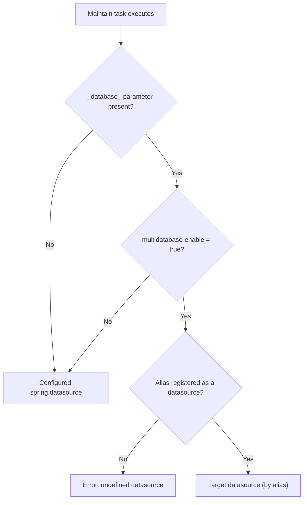

import Tabs from '@theme/Tabs';
import TabItem from '@theme/TabItem';

This document gives a minimum base to start with the AWE Scheduler module, and explains how to automate and schedule tasks inside AWE in a simple way.

The Scheduler module is based on the Quartz Scheduler library. 

All documentation related to the Quartz Scheduler library can be found on its [web page](https://quartz-scheduler.org/documentation).

## Prerequisites

The scheduler module needs to be configure before it is used. 

To see how to configure the scheduler module for your application see the **[Configuration guide](../scheduler-module.md)**.

## Remote scheduler setup

You can split the scheduler into a dedicated AWE instance and have your main AWE application delegate scheduling to it.

### 1. Configure the scheduler instance

On the dedicated scheduler node, enable scheduler-only mode and configure the callback to your main AWE app:

```properties
# Scheduler-only instance
awe.scheduler.scheduler-instance=true

# Callback to the main AWE instance
awe.scheduler.remote-callback-url=http://localhost:8080
awe.scheduler.remote-callback-secure-enabled=true
awe.scheduler.remote-callback-user=scheduler
awe.scheduler.remote-callback-password=ENC(yourEncryptedPassword)
```

### 2. Configure the main AWE instance

On the main AWE app, enable remote scheduler usage and point to the scheduler base API URL:

```properties
awe.scheduler.remote-enabled=true
awe.scheduler.remote-scheduler-url=http://localhost:8090/scheduler/api/v1
```

> **Note:** The remote scheduler base URL must target the scheduler instance API (default: `/scheduler/api/v1`).


* **[Tasks](#tasks)**
* **[Servers](#servers)**
* **[Calendars](#calendars)**
    

## `Tasks`

A task consists on a job associated to a trigger that is executed by the Scheduler in the configured time / moment.

A task can also be concatenated with other tasks to create a workflow. This can be done by adding those other tasks as dependencies in the parent task configuration wizard.

A task consists on a job associated to a trigger that is executed by the Scheduler in the configured time / moment.

A task can also be concatenated with other tasks in order to create a workflow. This can be done by adding those other tasks as dependencies in the parent task configuration wizard.

### Types

There are two type of tasks that the scheduler can work with, the maintain tasks and the command tasks.

| Maintain Task                                                        | Command Task                                                                                                          |
|----------------------------------------------------------------------|:---------------------------------------------------------------------------------------------------------------------|
| A maintain task executes a public maintain with a defined schedule.  | A command task runs a shell command with a defined schedule, either on the local AWE host or on a remote host over SSH. |

### Command execution: local and remote

A command task runs the value entered in the **Command** field as a shell command. The **Execution path**, when set, is used as the *working directory* the command runs in; the command itself is resolved from the host `PATH`. To run a script that lives in the execution path, invoke it explicitly (for example, `./my-script.sh`).

- **Local execution** (default): when **Run on remote server** is left unchecked, the command runs on the AWE host itself.
- **Remote execution over SSH**: when **Run on remote server** is checked, a **Remote server** must be selected. The command is executed on that host through an SSH exec channel, and both its standard output and standard error are captured into the task execution log.

Remote command execution requires the selected server to use the `ssh` connection type. Authentication is done with the server user together with either a password, a private key (optionally passphrase-protected), or both. See **[Servers](#servers)** for how to configure them, and the **[Configuration guide](../scheduler-module.md#ssh-remote-command-execution)** for the SSH host-key verification options.

### Task execution database

A **maintain task** runs against the datasource configured through Spring Boot's `spring.datasource.*` properties. This is the case in **both** execution modes:

- **Local (embedded) scheduler** &mdash; the maintain runs on the same datasource as the main AWE application.
- **Remote scheduler instance** &mdash; the maintain runs on the datasource configured for *that* scheduler instance.

:::info Why always the configured datasource?
Scheduler tasks run on a Quartz worker thread with **no bound HTTP session**. The interactive multi-database routing that a normal web request relies on reads its target from session/screen state, which simply does not exist here. The scheduler therefore resolves the connection from the configured `spring.datasource` instead of any session value.
:::

:::tip A remote scheduler's database is a deployment decision
There is no per-task switch to "run this task on the main application's database". A remote scheduler instance uses **its own** `spring.datasource`. To make it target the same database as your main application, point that instance's `spring.datasource.url` (and user, password, &hellip;) at the same database.
:::

#### Targeting a different database

If a specific maintain task must run against a **different** database than the configured default, add a **task parameter** (see [Task parameters](#2-task-parameters)) whose **name is the database criterion** and whose **value is the target datasource alias**.

The parameter name is **not** hardcoded to `database`: it is the value of [`awe.database.parameter-name`](../properties.md#awe.database.parameter-name), which defaults to `_database_`.

<Tabs>
<TabItem value="single" label="Single-database (default)" default>

Nothing to configure. With [`awe.database.multidatabase-enable`](../properties.md#awe.database.multidatabase-enable) set to `false` (the default), every task runs against the single configured `spring.datasource`, and a parameter named `_database_` is treated as an ordinary parameter with **no** routing effect.

</TabItem>
<TabItem value="multi" label="Multi-database">

On a deployment with `awe.database.multidatabase-enable=true`, add a task parameter in **step 2 (Task parameters)** of the wizard:

| Field  | Value                                                        |
|--------|-------------------------------------------------------------|
| Name   | `_database_` (or your configured `awe.database.parameter-name`) |
| Source | `Value`                                                      |
| Value  | The **alias** of the target datasource (e.g. `reporting`)   |

When the task executes, its maintain is routed to the datasource registered under that alias instead of the default one.

</TabItem>
</Tabs>

The connection is resolved as follows:



:::warning Requirements for routing to another database
- [`awe.database.multidatabase-enable`](../properties.md#awe.database.multidatabase-enable) must be `true`. When it is `false`, the parameter is ignored and the task always uses the default datasource.
- The **value must be a registered datasource alias**, not a raw JDBC URL. An unknown alias raises an *undefined datasource* error at execution time.
:::

:::note Command tasks are not affected
This applies to **maintain** tasks only. A **command** task runs a shell command and has no database connection; see [Command execution: local and remote](#command-execution-local-and-remote).
:::

### Configuration

When creating a new task, a task creation wizard is used to personalize the task configuration.

The configuration wizard consists in 5 steps:

#### 1. Basic information. ###

In this step we have to add the task basic configuration.

| Element                                   | Definition                                                                                                                                       |                         Use                          |
|-------------------------------------------|:-------------------------------------------------------------------------------------------------------------------------------------------------|:----------------------------------------------------:|
| Name                                      | Task name                                                                                                                                        |                     **Required**                     |
| Active                                    | Task status, if not active the task would not be launched                                                                                        |                     **Required**                     |
| Description                               | Task description                                                                                                                                 |                       Optional                       |
| Max. stored executions                    | Maximum number of executions to be stored in the database (Used to calculate the average time). The default value is 10.                         |                       Optional                       |
| Timeout                                   | Maximum time for the task to finish. If the task execution time exceeds the timeout time (represented in seconds) the task will be interrupted   |                       Optional                       |
| Execute                                   | The task execution type (Command or Maintain)                                                                                                    |                     **Required**                     |
| Command                                   | Command to launch                                                                                                                                | **Required** (Only needed in `Command` launch type)  |
| Execution path                            | Working directory the command runs in. The command is resolved from the host `PATH`; use `./<script>` to run a script located in this path       |   Optional (Only needed in `Command` launch type)    |
| Run on remote server                      | When checked, the command runs on a remote host over SSH instead of on the local AWE host                                                        |   Optional (Only needed in `Command` launch type)    |
| Remote server                             | The SSH server on which the command is executed                                                                                                  | **Required** when `Run on remote server` is checked  |
| Maintain                                  | Maintain to launch                                                                                                                               | **Required** (Only needed in `Maintain` launch type) |
| Launch dependencies in case of warning    | Launch the task dependencies in case of warning                                                                                                  |                       Optional                       |
| Launch dependencies in case of error      | Launch the task dependencies in case of error                                                                                                    |                       Optional                       |
| Set execution as warning in case of error | Sets the parent execution as warning in case of dependency error                                                                                 |                       Optional                       |

> **Note:** To add a new maintain to the Scheduler, the maintain must be set to `public="true"`.

#### 2. Task parameters ###

This step allows to add the needed parameters to the maintain or command for its execution.

These parameters are loaded to the application context when the task is going to be executed. In this way, the task can get the parameters in the execution time.

| Element       | Definition                                                                                                                                                     |     Use      |
|---------------|:---------------------------------------------------------------------------------------------------------------------------------------------------------------|:------------:|
| Name          | Parameter name                                                                                                                                                 | **Required** |
| Source        | Parameter source, the place from which the parameter will take its value                                                                                       | **Required** |
| Type          | The parameter type (Only used to give extra information to the user)                                                                                           | **Required** |
| Value         | For `Value`, the literal value used. For `Property`, the key of the application property to resolve. For `Variable`, the default value pre-filled in the manual-launch dialog (may be left empty) |   Optional   |


> **Note:** If the task launch type is `Maintain`, the needed parameters for the selected maintain will be automatically added to the task parameters screen.

##### Parameter sources #####

The **Source** determines where each parameter takes its value from at execution time:

- **Value** &mdash; the parameter uses the literal value typed in the **Value** field.
- **Property** &mdash; the value is resolved at execution time from the application property whose key is in the **Value** field (for example a value configured in `application.yml`). Use it to keep environment-specific values out of the task definition.
- **Variable** &mdash; the value is supplied by the operator **when the task is launched manually**. This is for inputs that are only known at run time (a business date, an entity id, a run mode&hellip;) and should not be hardcoded in the task.

When a task has one or more `Variable` parameters, launching it from the task list opens a dialog with an editable grid listing exactly those parameters. Each row is pre-filled with its configured **Value** as an editable default; the operator reviews or changes the values and presses **Launch**, and the task runs with them. Tasks without `Variable` parameters launch directly, with no dialog.

> **Note:** The dialog only appears on **manual** launch, where an operator is present to fill it in. On **scheduled** and **file** launches there is nobody to prompt, so a `Variable` parameter falls back to its configured **Value**. On **dependency** launch the value is inherited from the parent task &mdash; see [Parameter propagation to dependencies](#parameter-propagation-to-dependencies).

#### 3. Task launch ###

In this step we will configure the launch type for the task.

We can choose from three different options:

##### 1. Manual ####

The task will only be launched manually from the task list screen.

> **Note:** For a task to be added as a dependency, the launch type must be set to `Manual`.

##### 2. Scheduled ####

The task will be launched with a cron pattern based schedule.

See [schedule configuration guide](schedule-configuration) for more information about how to create schedules for a task.

##### 3. File ####

With this launch type, the task will launch a check in the selected file/s with the configured schedule.

To know how to create a schedule for the task see [schedule configuration guide](schedule-configuration).

The remaining fields are:

| Element      | Definition                                                   |     Use      |
|--------------|:-------------------------------------------------------------|:------------:|
| Search at    | The server in which the scheduler has to check for the files | **Required** |
| File path    | The path in which the file/s are located                     | **Required** |
| File pattern | The pattern that the files have to match with                | **Required** |
| User         | The user for the FTP connection                              |   Optional   |
| Password     | The password for the FTP connection                          |   Optional   |

#### 4. Task dependencies ###

In this step we will configure which tasks have to be executed after the current task finishes.

Playing with these options, we can create a workflow.

| Element  | Definition                                                                                                                                                                                                                          |     Use      |
|----------|:------------------------------------------------------------------------------------------------------------------------------------------------------------------------------------------------------------------------------------|:------------:|
| Task     | The task to be executed                                                                                                                                                                                                             | **Required** |
| Blocking | Defines if the task is blocking or not. If it is, the task will be executed synchronously, and it will cancel the dependency launch stack if the task ends with an error. Otherwise, the dependency will be launched asynchronously | **Required** |
| Order    | The order in which the synchronous task has to be launched in the synchronous dependency stack, the asynchronous dependencies will be launched as they come, with no defined order                                                  | **Required** |


> **Note:** The dependencies can also have their own dependencies to create a workflow.

##### Parameter propagation to dependencies

When a task launches its dependent (child) tasks, the parent's parameter values at execution time are propagated to each child. The **child defines the contract**: only the child's `Variable` parameters whose **name matches** a parent parameter are overridden with the parent's value. Every other parent parameter is ignored by that child, and the child's non-`Variable` parameters are never touched.

- **What propagates** &mdash; the parent's value for a given name, regardless of the parent parameter's source (`Value`, `Property` or `Variable`). Where the parent obtained the value is irrelevant; only the name matters.
- **Default when absent** &mdash; if the parent does not supply a matching name, the child keeps its own configured **Value** as the default (no regression versus previous behavior).
- **Cascade** &mdash; at each hop the propagation map is rebuilt from the current task's own parameter list, so a value only continues past an intermediate task if that task **also declares a parameter with that name**. A value the parent supplies for a name an intermediate child does not declare stops at that child and is not passed on to the grandchild.

Example, with a parent task that holds `database = "prod"` (source `Value`):

| Child parameter declaration | Effective value in the child | Why |
|---|---|---|
| `database` as `Variable` | `"prod"` | Name matches a parent parameter and the child opted in via `Variable` |
| `database` as `Value` = `"test"` | `"test"` | Not a `Variable`; never overridden |
| `region` as `Variable` (parent has no `region`) | its configured default | Parent supplies no matching name |

This reuses the same mechanism as the operator-supplied values on manual launch, so a value an operator typed into the parent's launch dialog also flows down to its dependents.

:::warning Trust boundary for sensitive values
Propagation is name-based: any dependent task that declares a `Variable` parameter matching a parent parameter name receives the parent's value at execution time &mdash; including values that may be sensitive (credentials, connection strings). Task configuration is an administrator-trusted boundary; do not attach dependencies of untrusted provenance to tasks holding sensitive parameters.
:::

#### 3. Task report ###

The last step is to choose a report type.

The report will give information about the task when it finishes.

We can choose one of these four options: 

##### 3.1 None ####

Used when we don't want to retrieve any report from the task.

This could be compared to the silent-action in AWE.

##### 3.2 Email ####

This option will send an email with the task information, and it will also add the dependencies information if any.

| Element           | Definition                                                                  |     Use      |
|-------------------|:----------------------------------------------------------------------------|:------------:|
| Send in case of   | Set the allowed status (task status when it finishes) for sending the email | **Required** |
| Email server      | The email server form where the email is going to be sent                   | **Required** |
| Send to users     | The list of users to send the email                                         | **Required** |
| Title             | The title of the email                                                      | **Required** |
| Message           | The message to be added in the email                                        | **Required** |

> **Note:** The email will also add basic information about the task itself and its dependencies.

###### Dynamic variables in Title and Message

The **Title** and **Message** fields support `${variable}` placeholders that are resolved with per-execution values before the email is sent. This lets a single template produce a customized email for every task execution.

Placeholders can reference two kinds of values: **task/execution metadata** (reserved names) and **task parameters** (by name).

**Metadata variables**

| Variable             | Description                                             |
|----------------------|--------------------------------------------------------|
| `${taskName}`        | Name of the task                                       |
| `${taskId}`          | Task identifier                                        |
| `${taskDescription}` | Task description                                       |
| `${status}`          | Final execution status label (e.g. `OK`, `ERROR`)      |
| `${statusDetail}`    | Additional detail about the execution status           |
| `${executionId}`     | Execution identifier                                   |
| `${command}`         | Command/action executed by the task                    |

**Task parameter variables**

Any placeholder whose name matches a task parameter (from the task **Parameters** tab) is replaced with that parameter's value. For example, `${env}` resolves to the value of the `env` parameter.

**Resolution rules**

- **Reserved names take precedence.** If a task parameter has the same name as a metadata variable (e.g. `status`), the metadata value wins and a warning is logged naming the shadowed parameter.
- **Unknown placeholders are kept literally.** A `${variable}` with no matching metadata key or task parameter is left untouched in the output; it is never blanked or removed.
- **HTML is escaped safely.** In the HTML body, substituted values are HTML-escaped so they cannot break the markup or inject content; the plain-text body receives the raw values. The template text itself is never escaped.
- **Backward compatible.** A Title or Message without any `${...}` placeholder is sent exactly as written.

**Example**

- Title: `Task ${taskName} finished: ${status}`
- Message: `Execution ${executionId} for environment ${env} ended with status ${status}.`

> **Note:** Variable substitution applies only to the **Title** and **Message** fields, not to the fixed task-details block that the report appends automatically.

##### 3.3 Broadcast ####

This option will send a broadcast message with the given message to the selected users only.

| Element          | Definition                                                                      |     Use      |
|------------------|:--------------------------------------------------------------------------------|:------------:|
| Send in case of  | Set the allowed status (task status when it finishes) for sending the broadcast | **Required** |
| Send to users    | The list of users to send the broadcast                                         | **Required** |
| Message          | The message to be sent in the broadcast                                         | **Required** |

#### 4. Maintain####

This option will launch the selected maintain as a report.

| Element          | Definition                                                                                                 |     Use      |
|------------------|:-----------------------------------------------------------------------------------------------------------|:------------:|
| Send in case of  | Set the allowed status (task status when it finishes) for executing the maintain                           | **Required** |
| Message          | The message to be sent, it will be added to the context in order to be available for the selected maintain |   Optional   |

> **Note:** The task data will be added to the context in order to be available for the selected maintain, to get the data, it is recommended to use the TaskConstants interface variable names from the Scheduler package.

### Task management

The existing tasks can be managed from the scheduler tasks screen, where we will have a list of the created tasks.

The list will show some basic information of each task, like the name, the launch type (icon), the last and next execution times, the task status and the execution average time.

When selecting one task, some options will be activated:

| Option              | Definition                                                                                                                         | Multiple |
|---------------------|:-----------------------------------------------------------------------------------------------------------------------------------|:--------:|
| Update              | Update the selected task                                                                                                           |    No    |
| Delete              | Delete the selected task/s                                                                                                         |   Yes    |
| Start               | Launch the selected task as a manual task. It doesn't need to be a manual task in order to launch an instance of the task manually |    No    |
| Activate/Deactivate | Act                                                                                                                                |          |

## `Servers`

The servers created for the Scheduler module are mainly used to execute tasks, and in tasks that need to check if a file has changed.

The servers can be instantiated multiple times, and each instantiation can use its own user and password to connect to the server with the selected protocol.

The scheduler servers are used with two purposes: to run command tasks on a remote host over SSH, and to check for file modifications on an FTP server.

For remote command execution choose the `ssh` connection type and provide the connection user together with a password and/or a private key (which may be passphrase-protected); for file checking use the `ftp` connection type.

Regarding the FTP servers, the same server can be used as many times as needed, in different tasks, with different credentials.

### Configuration

When creating a new server, the next fields have to be filled:

| Element            | Definition                                          |     Use      |
|--------------------|:----------------------------------------------------|:------------:|
| Name               | Server name                                         | **Required** |
| Server             | Server IP address                                   | **Required** |
| Port               | Server port                                         | **Required** |
| Type of connection | The protocol to be used to connect to the server    | **Required** |
| User               | User for the SSH connection (shown when the connection type is `ssh`)     | **Required** for `ssh` |
| Password           | Password for the SSH connection (shown when the connection type is `ssh`) |   Optional   |
| Private key        | Private key for SSH key-based authentication (shown when the connection type is `ssh`) |   Optional   |
| Private key passphrase | Passphrase that unlocks the private key, if it is encrypted (shown when the connection type is `ssh`) |   Optional   |
| Active             | Server status                                       | **Required** |

> **Note:** If a server is deactivated, the task using it won't even try to connect to it.

> **Note:** An SSH server authenticates with the user plus a password, a private key (optionally unlocked with its passphrase), or both. Only the user is mandatory; provide at least one of password or key.

> **Note:** SSH authentication is handled by [Apache MINA SSHD](https://mina.apache.org/sshd-project/). The most common private-key algorithms are supported — **RSA**, **ECDSA** and **Ed25519** — in OpenSSH and PEM formats.

> **Note:** SSH credentials (password, private key and passphrase) are stored encrypted, per server instance, so the same host can be registered several times with different credentials. On the edit screen they are never sent back to the client: leave a secret field blank to keep the stored value, or type a new value to replace it.

### Management

The scheduler server list will show a list of servers with their basic information: name, server ip, connection protocol and status.

When selecting one of the servers from the list, some options will be enabled:

| Option                | Definition                                                                                                      | Multiple    |
|-----------------------|:----------------------------------------------------------------------------------------------------------------|:------------|
| Update                | Update the selected server                                                                                      | No          |
| Delete                | Deletes the selected server/s                                                                                   | Yes         |
| Activate / Deactivate | Activates / deactivates the selected server, the label changes depending on the selected servers current status | No          |


## `Calendars`

The task inside the scheduler can be modified to ignore some dates by using holiday calendars.

Those calendars contain the dates that have to be ignored by the scheduler in the task schedule.

Each of the tasks can only be associated with one calendar.

The calendars inside Scheduler module are used to set the dates where the tasks won't have to be executed, like for example, holidays, or weekends. 

Each task can only have associated one calendar, but there can be created as many calendars as needed, and then just change the calendar associated to the task.

### Configuration

The calendar configuration procedure consists in two steps:

#### Create calendar

The first step is to create the calendar itself, which will have the next basic information.

| Element       | Definition                  |     Use      |
|---------------|:----------------------------|:------------:|
| Name          | The calendar name           | **Required** |
| Description   | The calendar description    | **Required** |
| Active        | The calendar status         | **Required** |

> **Note:** If the calendar status is set to `Active = No` the task will ignore the calendar, and it will be launch as if it wasn't associated with it.

#### Add dates

Once the calendar is created, from the calendar configuration screen, we can add new dates by selecting the option edit on the top right side of the screen.

When we get to the edition screen we will have to fill the next fields for each date.

| Element     | Definition                                                   |     Use      |
|-------------|:-------------------------------------------------------------|:------------:|
| Date        | The date to add to the calendar                              | **Required** |
| Name        | A name to assign to the date, for example, a holiday name    |   Optional   |

### Management

On the calendar list screen, when selecting one of them, the next options will be available:

| Option              | Definition                                                                                                          |  Multiple  |
|---------------------|:--------------------------------------------------------------------------------------------------------------------|:----------:|
| Edit                | Redirects to the edition screen where we can change the calendar data, and add/remove/update calendar dates         |     No     |
| Delete              | Delete calendar and all its associated dates                                                                        |    Yes     |
| Activate/Deactivate | Activates / deactivates the selected calendar, the label changes depending on the selected calendars current status |     No     |
