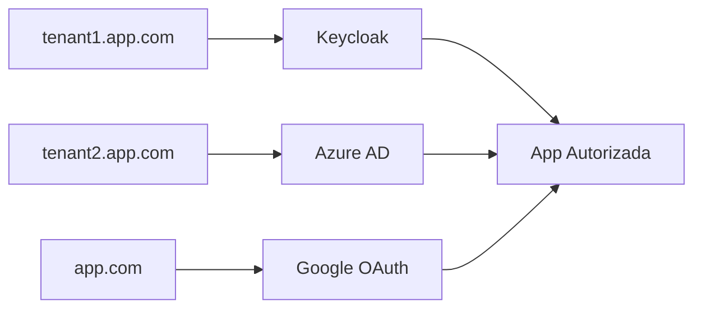

# Single sign On
In AWE applications you can use SSO authentication method. This feature allows a user to utilize a single account to access different apps (user name and password).

## Azure EntraID
AWE provide Azure oauth2 authentication service integration using native `spring-cloud-azure-starter-active-directory`. Uses the Spring Boot Starter for Microsoft Entra ID enables you to connect your web application to a Microsoft Entra tenant and protect your resource server with Microsoft Entra ID. It uses the Oauth 2.0 protocol to protect web applications and resource servers.


To enable Azure oauth2 active directory, you have to add spring-cloud-azure starter and configure your organization tenantId and application ID and secret.

```xml title="Add dependency"
    <dependency>
      <groupId>com.azure.spring</groupId>
      <artifactId>spring-cloud-azure-starter-active-directory</artifactId>
    </dependency>
```
```properties title="Configure azure EntraID properties"
# Enable related features.
spring.cloud.azure.active-directory.enabled=true
# Specifies your Active Directory ID:
spring.cloud.azure.active-directory.profile.tenant-id={CONFIGURE YOUR TENANT ID}
# Specifies your App Registration's Application ID:
spring.cloud.azure.active-directory.credential.client-id={CONFIGURE YOUR CLIENT ID}
# Specifies your App Registration's secret key:
spring.cloud.azure.active-directory.credential.client-secret={CONFIGURE YOUR SECRET KEY}
```

:::info You can visit [this](https://learn.microsoft.com/en-us/azure/developer/java/spring-framework/spring-boot-starter-for-azure-active-directory-developer-guide?tabs=SpringCloudAzure4x) for more info. 
:::

By default, if the user logged in the application with this  doesn't exist in database, it  will be provisioned by registering it by adding a new record in the user table.
If you do not want this behavior, you can disable it setting false the configuration property `awe.security.auto-provision-use`.

## Keycloak


Configure the client by setting the Root URL, Web origins, Admin URL to the hostname (https://\{hostname}).

Also you can set Home URL to /applications path and Valid Post logout redirect URIs to "https://\{hostname}/applications".

The Valid Redirect URIs should be set to https://\{hostname}/auth/callback (you can also set the less secure https://\{hostname}/* for testing/development purposes, but it's not recommended in production).


Make sure to click Save.

There should be a tab called Credentials. You can copy the Client Secret that we'll use in our app configuration.


The following configuration properties need to be added to integrate an AWE application with the Keycloak server

```properties title="Configure keycloak oauth client properties"
################################################
# SSO login
################################################
# Enable AWE SSO
awe.security.sso.enabled=true
# Auto launch sso flow (skip native window sign in)
awe.security.sso.auto-launch=true
# Filter authority prefix (used to filtering granted authorities in post authentication process)
awe.security.sso.filter-authority-prefix=role_
# Enable generic SSO button in login screen
awe.security.sso.enable-generic-sso-button=true

# Provider issuer uri
spring.security.oauth2.client.provider.keycloak.issuer-uri=[PROVIDER_URI]
# Oauth provider name
spring.security.oauth2.client.registration.keycloak.provider=keycloak
# Authorization grant type for login
spring.security.oauth2.client.registration.keycloak.authorization-grant-type=authorization_code
# Client Id
spring.security.oauth2.client.registration.keycloak.client-id=[CLIENT_ID]
# Client Secret
spring.security.oauth2.client.registration.keycloak.client-secret=[CLIENT_SECRET]
# Scope request
spring.security.oauth2.client.registration.keycloak.scope=openid
# Redirect URI
spring.security.oauth2.client.registration.keycloak.redirect-uri={baseUrl}/login/oauth2/code/keycloak
```

## Multi-Tenant SSO


AWE Framework supports multi-tenant SSO authentication, allowing different organizations or clients to use the same application instance with their own separate OAuth2 configurations. Each tenant can have its own identity provider settings while sharing the same application codebase.

### How Multi-Tenant Works

The multi-tenant functionality in AWE uses **subdomain-based tenant resolution**. When a user accesses the application through different subdomains, the system automatically determines which tenant configuration to use:

- `tenant1.yourdomain.com` → Uses "tenant1" configuration
- `tenant2.yourdomain.com` → Uses "tenant2" configuration  
- `yourdomain.com` → Uses default tenant configuration


### Configuration

To enable multi-tenant SSO, you need to configure the following properties:

```properties title="Enable Multi-Tenant SSO"
# Enable multi-tenant functionality
awe.security.sso.multitenant.enabled=true

# Set the default tenant (used when no specific tenant is detected)
awe.security.sso.multitenant.default-tenant=public
```

### Tenant-Specific Configuration

Each tenant requires its own OAuth2 registration and provider configuration using standard Spring Security OAuth2 properties. The configuration follows this pattern:

```properties title="Multi-Tenant Configuration Pattern"
# Provider configuration for a tenant
spring.security.oauth2.client.provider.{tenant-name}.issuer-uri={PROVIDER_ISSUER_URI}
spring.security.oauth2.client.provider.{tenant-name}.user-name-attribute=preferred_username

# Registration configuration for a tenant
spring.security.oauth2.client.registration.{tenant-name}.provider={tenant-name}
spring.security.oauth2.client.registration.{tenant-name}.client-id={CLIENT_ID}
spring.security.oauth2.client.registration.{tenant-name}.client-secret={CLIENT_SECRET}
spring.security.oauth2.client.registration.{tenant-name}.authorization-grant-type=authorization_code
spring.security.oauth2.client.registration.{tenant-name}.scope=openid,profile,email
spring.security.oauth2.client.registration.{tenant-name}.redirect-uri={baseUrl}/login/oauth2/code/{tenant-name}
spring.security.oauth2.client.registration.{tenant-name}.client-name={CLIENT_DISPLAY_NAME}
```

### Complete Example Configuration

Here's a complete example showing how to configure multiple tenants:

```properties title="Complete Multi-Tenant Example"
################################################
# Multi-Tenant SSO Configuration
################################################
# Enable SSO authentication
awe.security.sso.enabled=true
# Auto launch sso flow (skip native window sign in)
awe.security.sso.auto-launch=true
# Filter authority prefix (used to filtering granted authorities in post authentication process)
awe.security.sso.filter-authority-prefix=role_


# Enable multi-tenant functionality
awe.security.sso.multitenant.enabled=true
awe.security.sso.multitenant.default-tenant=public

# Default tenant configuration (public.yourdomain.com or yourdomain.com)
# Provider
spring.security.oauth2.client.provider.public.issuer-uri=http://localhost:8081/realms/public

# Registration
spring.security.oauth2.client.registration.public.provider=public
spring.security.oauth2.client.registration.public.client-id={awe-public-client}
spring.security.oauth2.client.registration.public.client-secret={your-public-client-secret}
spring.security.oauth2.client.registration.public.authorization-grant-type=authorization_code
spring.security.oauth2.client.registration.public.scope=openid,profile,email
spring.security.oauth2.client.registration.public.redirect-uri={baseUrl}/login/oauth2/code/public
spring.security.oauth2.client.registration.public.client-name=AWE Public

# Company A tenant configuration (companyA.yourdomain.com)
# Provider
spring.security.oauth2.client.provider.companyA.issuer-uri=http://localhost:8081/realms/companyA

# Registration
spring.security.oauth2.client.registration.companyA.provider=companyA
spring.security.oauth2.client.registration.companyA.client-id={awe-companyA-client}
spring.security.oauth2.client.registration.companyA.client-secret={your-companyA-client-secret}
spring.security.oauth2.client.registration.companyA.authorization-grant-type=authorization_code
spring.security.oauth2.client.registration.companyA.scope=openid,profile,email
spring.security.oauth2.client.registration.companyA.redirect-uri={baseUrl}/login/oauth2/code/companyA
spring.security.oauth2.client.registration.companyA.client-name=AWE Company A

# Company B tenant configuration (companyB.yourdomain.com)
# Provider
spring.security.oauth2.client.provider.companyB.issuer-uri=http://localhost:8081/realms/companyB
spring.security.oauth2.client.provider.companyB.user-name-attribute=preferred_username

# Registration
spring.security.oauth2.client.registration.companyB.provider=companyB
spring.security.oauth2.client.registration.companyB.client-id={awe-companyB-client}
spring.security.oauth2.client.registration.companyB.client-secret={your-companyB-client-secret}
spring.security.oauth2.client.registration.companyB.authorization-grant-type=authorization_code
spring.security.oauth2.client.registration.companyB.scope=openid,profile,email
spring.security.oauth2.client.registration.companyB.redirect-uri={baseUrl}/login/oauth2/code/companyB
spring.security.oauth2.client.registration.companyB.client-name=AWE Company B
```

### Multi-Tenant with Different Identity Providers

You can also configure different tenants to use completely different identity providers:

```properties title="Mixed Identity Providers Example"
# Tenant using Keycloak
spring.security.oauth2.client.provider.keycloak-tenant.issuer-uri=http://keycloak.example.com/realms/tenant1
spring.security.oauth2.client.registration.keycloak-tenant.provider=keycloak-tenant
spring.security.oauth2.client.registration.keycloak-tenant.client-id=keycloak-client
spring.security.oauth2.client.registration.keycloak-tenant.client-secret=keycloak-secret
spring.security.oauth2.client.registration.keycloak-tenant.authorization-grant-type=authorization_code
spring.security.oauth2.client.registration.keycloak-tenant.scope=openid,profile,email
spring.security.oauth2.client.registration.keycloak-tenant.redirect-uri={baseUrl}/login/oauth2/code/keycloak-tenant

# Tenant using Azure EntraID
spring.security.oauth2.client.provider.azure-tenant.issuer-uri=https://login.microsoftonline.com/{tenant-id}/v2.0
spring.security.oauth2.client.registration.azure-tenant.provider=azure-tenant
spring.security.oauth2.client.registration.azure-tenant.client-id=azure-client-id
spring.security.oauth2.client.registration.azure-tenant.client-secret=azure-client-secret
spring.security.oauth2.client.registration.azure-tenant.authorization-grant-type=authorization_code
spring.security.oauth2.client.registration.azure-tenant.scope=openid,profile,email
spring.security.oauth2.client.registration.azure-tenant.redirect-uri={baseUrl}/login/oauth2/code/azure-tenant

# Tenant using Google
spring.security.oauth2.client.provider.google-tenant.issuer-uri=https://accounts.google.com
spring.security.oauth2.client.registration.google-tenant.provider=google-tenant
spring.security.oauth2.client.registration.google-tenant.client-id=google-client-id
spring.security.oauth2.client.registration.google-tenant.client-secret=google-client-secret
spring.security.oauth2.client.registration.google-tenant.authorization-grant-type=authorization_code
spring.security.oauth2.client.registration.google-tenant.scope=openid,profile,email
spring.security.oauth2.client.registration.google-tenant.redirect-uri={baseUrl}/login/oauth2/code/google-tenant
```

### DNS Configuration

For subdomain-based tenant resolution to work, you need to configure your DNS to point all subdomains to your application:

```bash title="DNS Configuration Example"
# Main domain
yourdomain.com        A    192.168.1.100

# Wildcard subdomain (points all subdomains to the same server)
*.yourdomain.com      A    192.168.1.100
```

### Benefits of Multi-Tenant SSO

- **Isolation**: Each tenant has its own authentication configuration
- **Flexibility**: Different tenants can use different identity providers
- **Scalability**: Single application instance serves multiple organizations
- **Maintenance**: Centralized application updates benefit all tenants
- **Security**: Tenant configurations are completely separated

::::info
The multi-tenant functionality automatically handles tenant resolution based on the request subdomain. If a tenant is not configured, the system falls back to the default tenant configuration.
::::

::::warning
Make sure to properly configure your DNS and SSL certificates to support wildcard subdomains when using multi-tenant functionality.
::::

### Add identity providers
You can integrate others identity provider to use in your authentication process. In this guide, we use Azure EntraID as example.


In the detail page, fill out the details as required below:
* Enter the alias of your choice. Enable use discovery endpoint, if not already enabled
* Input the Discovery URL from Azure (copied before) into the Discovery endpoint


* Input the Client ID. This is the application (client) ID copied from Azure app registration.
* Input Client Secret. This is the application secret copied from Azure app registration


### Mappers

When configuring roles/groups, the process is a bit more tedious since the claims used for this are not standard. Each provider uses a different method.

In order to collect the information sent to us by the provider, we will have to create some mappers that retrieve the information and translate it into the keycloak environment.

- Group mappers

By default, Azure EntraID does not display the groups associated with each user. In order to retrieve the groups to which a user belongs, it is necessary to configure Azure to send a custom claim `groups` with token type ClientID.


Then, you have to create a new mapper for identity provider to map user group objectId to keycloak role.


- App role mappers

In order to retrieve the app roles of an application registered in Azure EntraID, it is necessary to create an `advanced claim custom role mapper` that maps the claim *role* key with the name of application role in Azure with the keycloak role.


