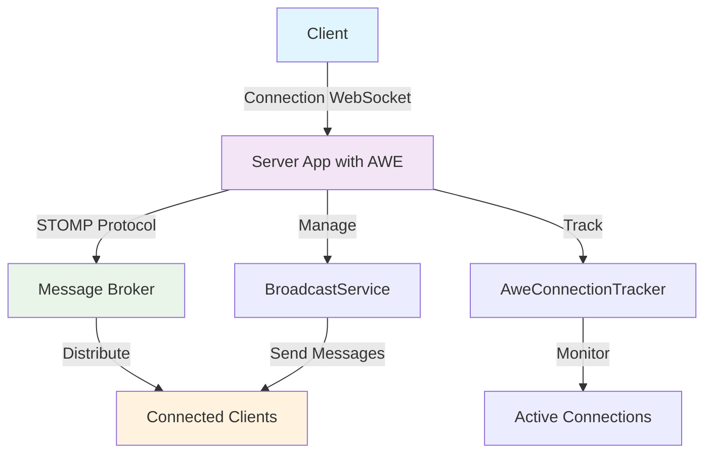
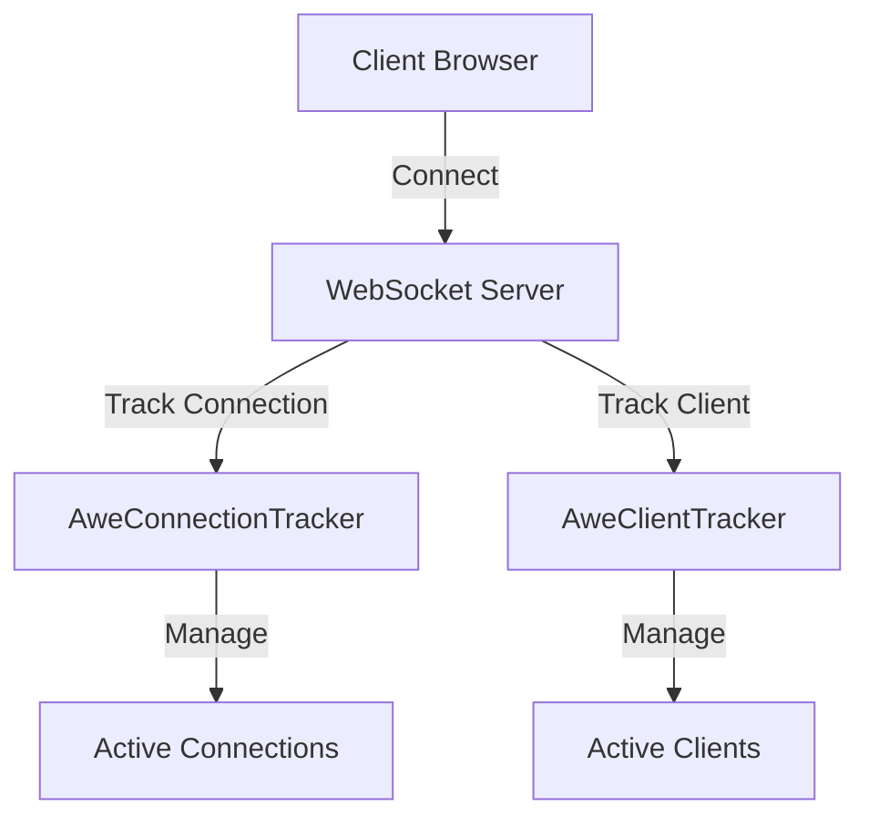

# 🔌 WebSockets in AWE

## 🚀 Introduction

WebSockets provide a persistent connection between a client and server, allowing for bidirectional, real-time communication. The AWE framework integrates WebSockets using the STOMP (Simple Text Oriented Messaging Protocol) protocol over WebSocket, which provides a standardized way to send and receive messages.



## 🔧 How WebSockets Work in AWE

The AWE framework uses Spring's WebSocket support to implement WebSocket functionality. The implementation consists of several key elements:

### ⚙️ WebSocket Configuration

The WebSocket configuration in AWE is handled by the `WebsocketConfig` class, which extends Spring's `AbstractSessionWebSocketMessageBrokerConfigurer`. This class configures the message broker and registers the STOMP endpoints.

> 💡 **Key Point**: The configuration is automatically set up when you include the AWE Spring Boot Starter in your project.

The configuration supports two types of message brokers:

| Broker Type            | Description                                                                                            | Use Case                     |
|------------------------|--------------------------------------------------------------------------------------------------------|------------------------------|
| **Simple Broker**      | Used by default, it's an in-memory message broker that handles message routing within the application. | Single instance applications |
| **STOMP Broker Relay** | When enabled, it relays messages to an external STOMP message broker like RabbitMQ.                    | Clustered environments       |

### 🔍 Connection Tracking

AWE provides connection tracking through the `AweConnectionTracker` and `AweClientTracker` classes. These track active WebSocket connections and clients, allowing the application to manage and communicate with connected clients.



### 📢 Broadcasting Service

The `BroadcastService` allows sending messages to all connected clients or to specific clients based on their session ID or user ID. This is useful for notifications, real-time updates, and other broadcast scenarios.

### 📡 WebSocket Events

The `WebSocketEventListener` handles WebSocket connection events, such as when a client connects or disconnects. This allows the application to perform actions when these events occur.

## ⚙️ Configuring WebSockets in AWE

WebSockets in AWE can be configured using properties in your `application.properties` or `application.yml` file. The properties have the prefix `awe.websocket.stomp`.

### 🔰 Basic Configuration

By default, AWE uses a simple in-memory message broker. This is suitable for most applications where messages don't need to be persisted or shared across multiple instances.

```properties
# Default configuration (Simple Broker)
awe.websocket.stomp.enable-stomp-broker-relay=false
```

### 🔄 Using an External STOMP Broker

For more advanced scenarios, such as clustering or message persistence, you can configure AWE to use an external STOMP broker like RabbitMQ:

```properties
# Enable STOMP broker relay
awe.websocket.stomp.enable-stomp-broker-relay=true
awe.websocket.stomp.relay-host=rabbitmq-service
awe.websocket.stomp.relay-port=61613
awe.websocket.stomp.client-login=guest
awe.websocket.stomp.client-passcode=guest
awe.websocket.stomp.system-login=guest
awe.websocket.stomp.system-passcode=guest
```

### 🎯 Destination Prefixes

You can configure the destination prefixes that the message broker handles:

```properties
# Configure destination prefixes
awe.websocket.stomp.destination-prefixes=/topic,/queue
```

## 💻 Using WebSockets in Your Application

### 📤 Sending Messages from the Server

To send messages from the server to clients, you can use the `BroadcastService`:

```java
// In your service or controller class
public class YourService {
    @Autowired
    private BroadcastService broadcastService;

    public void sendNotification() {
        // Send Screen client action to all clients
        broadcastService.broadcastMessage(new ScreenActionBuilder("newScreen").build());

        // Send a message to a specific client
        broadcastService.sendMessageToUser("userId", "Hello, specific user!");
    }
}
```

## ☁️ Cloud Environment Configuration

In a cloud environment, you have to configure an external STOMP broker relay as `RabbitMQ` or `ActiveMQ` and configure the websocket relay AWE configuration properties. This is useful when deploying multiple instances of your application, as it allows messages to be shared across all instances.

```properties
# Enable STOMP broker relay
awe.websocket.stomp.enable-stomp-broker-relay=true
```

> ⚠️ **Important**: When deploying in a clustered environment, make sure all instances can access the same message broker to ensure message delivery to all clients regardless of which instance they're connected to.

## 🏁 Conclusion

WebSockets in AWE provide a powerful way to implement real-time communication between the server and clients. By using STOMP over WebSocket, AWE provides a standardized and reliable messaging system that can be easily configured and extended to meet your application's needs.

For more information on the available configuration properties, see the [Properties](properties.md#awe-websocket-properties) documentation.
