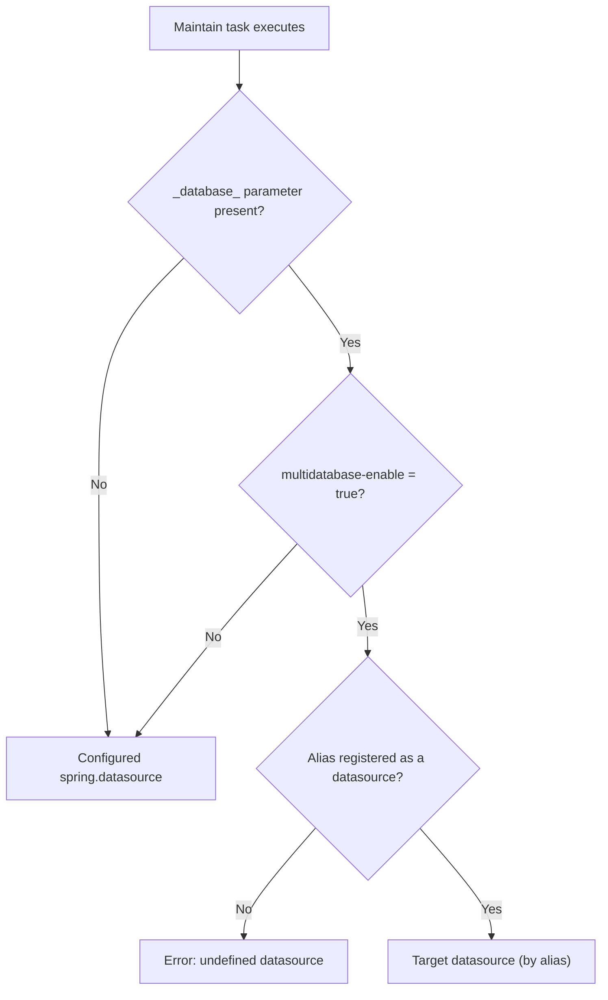

import Tabs from '@theme/Tabs';
import TabItem from '@theme/TabItem';

Este documento ofrece una base mínima para empezar con el módulo Scheduler de AWE, y explica cómo automatizar y planificar tareas dentro de AWE de forma sencilla.

El módulo Scheduler está basado en la librería Quartz Scheduler.

Toda la documentación relacionada con la librería Quartz Scheduler se puede encontrar en su [página web](https://quartz-scheduler.org/documentation).

## Requisitos previos {#prerequisites}

El módulo scheduler necesita ser configurado antes de usarse.

Para ver cómo configurar el módulo scheduler en tu aplicación consulta la **[guía de configuración](../scheduler-module.md)**.

## Configuración del planificador remoto {#remote-scheduler-setup}

Puedes separar el planificador en una instancia de AWE dedicada y hacer que tu aplicación AWE principal le delegue la planificación.

### 1. Configurar la instancia del planificador {#1-configure-the-scheduler-instance}

En el nodo dedicado al planificador, habilita el modo solo planificador y configura la devolución de llamada (callback) hacia tu aplicación AWE principal:

```properties
# Scheduler-only instance
awe.scheduler.scheduler-instance=true

# Callback to the main AWE instance
awe.scheduler.remote-callback-url=http://localhost:8080
awe.scheduler.remote-callback-secure-enabled=true
awe.scheduler.remote-callback-user=scheduler
awe.scheduler.remote-callback-password=ENC(yourEncryptedPassword)
```

### 2. Configurar la instancia principal de AWE {#2-configure-the-main-awe-instance}

En la aplicación AWE principal, habilita el uso del planificador remoto y apunta a la URL base de la API del planificador:

```properties
awe.scheduler.remote-enabled=true
awe.scheduler.remote-scheduler-url=http://localhost:8090/scheduler/api/v1
```

> **Nota:** La URL base del planificador remoto debe apuntar a la API de la instancia del planificador (por defecto: `/scheduler/api/v1`).


* **[Tareas](#tasks)**
* **[Servidores](#servers)**
* **[Calendarios](#calendars)**
    

## Tareas {#tasks}

Una tarea consiste en un trabajo asociado a un disparador que es ejecutado por el planificador en el momento configurado.

Una tarea también puede encadenarse con otras tareas para crear un flujo de trabajo. Esto se hace añadiendo esas otras tareas como dependencias en el asistente de configuración de la tarea padre.

Una tarea consiste en un trabajo asociado a un disparador que es ejecutado por el planificador en el momento configurado.

Una tarea también puede encadenarse con otras tareas para crear un flujo de trabajo. Esto se hace añadiendo esas otras tareas como dependencias en el asistente de configuración de la tarea padre.

### Tipos {#types}

Hay dos tipos de tareas con los que puede trabajar el planificador: las tareas maintain y las tareas de comando.

| Tarea maintain                                                       | Tarea de comando                                                                                                      |
|----------------------------------------------------------------------|:---------------------------------------------------------------------------------------------------------------------|
| Una tarea maintain ejecuta un maintain público con una planificación definida. | Una tarea de comando ejecuta un comando de shell con una planificación definida, ya sea en el host local de AWE o en un host remoto mediante SSH. |

### Ejecución de comandos: local y remota {#command-execution-local-and-remote}

Una tarea de comando ejecuta el valor introducido en el campo **Command** como un comando de shell. La **Execution path**, cuando se define, se usa como *directorio de trabajo* en el que se ejecuta el comando, y también actúa como ubicación alternativa para el propio comando: el comando se busca primero en el `PATH` del host, y solo cuando el `PATH` no lo proporciona se usa un archivo ejecutable con ese nombre dentro de la ruta de ejecución. Por tanto, un script que viva en la ruta de ejecución se ejecuta por su nombre simple, mientras que un comando del sistema como `ls` o `python` siempre se sigue resolviendo desde el `PATH` y nunca queda oculto por un archivo del mismo nombre en la ruta de ejecución. Un comando que ya contiene un separador de ruta (`./my-script.sh`, o una ruta absoluta) se usa exactamente como está escrito.

- **Ejecución local** (por defecto): cuando **Run on remote server** se deja sin marcar, el comando se ejecuta en el propio host de AWE.
- **Ejecución remota mediante SSH**: cuando **Run on remote server** está marcado, hay que seleccionar un **Remote server**. El comando se ejecuta en ese host a través de un canal de ejecución SSH, y tanto su salida estándar como su salida de error se capturan en el registro de ejecución de la tarea.

La ejecución remota de comandos requiere que el servidor seleccionado use el tipo de conexión `ssh`. La autenticación se realiza con el usuario del servidor junto con una contraseña, una clave privada (opcionalmente protegida con frase de contraseña), o ambas. Consulta **[Servidores](#servers)** para ver cómo configurarlos, y la **[guía de configuración](../scheduler-module.md#ssh-remote-command-execution)** para las opciones de verificación de claves de host SSH.

### Base de datos de ejecución de la tarea {#task-execution-database}

Una **tarea maintain** se ejecuta contra el datasource configurado mediante las propiedades `spring.datasource.*` de Spring Boot. Este es el caso en **ambos** modos de ejecución:

- **Planificador local (embebido)** &mdash; el maintain se ejecuta sobre el mismo datasource que la aplicación AWE principal.
- **Instancia de planificador remota** &mdash; el maintain se ejecuta sobre el datasource configurado para *esa* instancia del planificador.

:::info ¿Por qué siempre el datasource configurado?
Las tareas del planificador se ejecutan en un hilo de trabajo de Quartz **sin sesión HTTP asociada**. El enrutamiento interactivo multibase de datos en el que se apoya una petición web normal lee su destino del estado de la sesión/pantalla, que simplemente no existe aquí. Por ello, el planificador resuelve la conexión a partir del `spring.datasource` configurado en lugar de cualquier valor de sesión.
:::

:::tip La base de datos de un planificador remoto es una decisión de despliegue
No existe un interruptor por tarea para "ejecutar esta tarea en la base de datos de la aplicación principal". Una instancia de planificador remota usa **su propio** `spring.datasource`. Para que apunte a la misma base de datos que tu aplicación principal, haz que el `spring.datasource.url` de esa instancia (y el usuario, la contraseña, &hellip;) apunten a la misma base de datos.
:::

#### Apuntar a una base de datos diferente {#targeting-a-different-database}

Si una tarea maintain concreta debe ejecutarse contra una base de datos **diferente** de la configurada por defecto, añade un **parámetro de tarea** (consulta [Parámetros de la tarea](#2-task-parameters)) cuyo **nombre sea el criterio de base de datos** y cuyo **valor sea el alias del datasource de destino**.

El nombre del parámetro **no** está fijado a `database`: es el valor de [`awe.database.parameter-name`](../properties.md#awe.database.parameter-name), que por defecto es `_database_`.

<Tabs>
<TabItem value="single" label="Single-database (default)" default>

No hay nada que configurar. Con [`awe.database.multidatabase-enable`](../properties.md#awe.database.multidatabase-enable) establecido a `false` (el valor por defecto), cada tarea se ejecuta contra el único `spring.datasource` configurado, y un parámetro llamado `_database_` se trata como un parámetro ordinario **sin** efecto de enrutamiento.

</TabItem>
<TabItem value="multi" label="Multi-database">

En un despliegue con `awe.database.multidatabase-enable=true`, añade un parámetro de tarea en el **paso 2 (Parámetros de la tarea)** del asistente:

| Campo  | Valor                                                        |
|--------|-------------------------------------------------------------|
| Name   | `_database_` (o tu `awe.database.parameter-name` configurado) |
| Source | `Value`                                                      |
| Value  | El **alias** del datasource de destino (p. ej. `reporting`)   |

Cuando la tarea se ejecuta, su maintain se enruta al datasource registrado bajo ese alias en lugar del predeterminado.

</TabItem>
</Tabs>

La conexión se resuelve de la siguiente manera:



:::warning Requisitos para enrutar a otra base de datos
- [`awe.database.multidatabase-enable`](../properties.md#awe.database.multidatabase-enable) debe ser `true`. Cuando es `false`, el parámetro se ignora y la tarea siempre usa el datasource predeterminado.
- El **valor debe ser un alias de datasource registrado**, no una URL JDBC sin procesar. Un alias desconocido genera un error de *datasource no definido* en tiempo de ejecución.
:::

:::note Las tareas de comando no se ven afectadas
Esto se aplica solo a las tareas **maintain**. Una tarea de **comando** ejecuta un comando de shell y no tiene conexión a base de datos; consulta [Ejecución de comandos: local y remota](#command-execution-local-and-remote).
:::

### Configuración {#configuration}

Al crear una nueva tarea, se utiliza un asistente de creación de tareas para personalizar la configuración de la tarea.

El asistente de configuración consta de 5 pasos:

#### 1. Información básica {#1-basic-information}

En este paso tenemos que añadir la configuración básica de la tarea.

| Elemento                                  | Definición                                                                                                                                       |                         Uso                          |
|-------------------------------------------|:-------------------------------------------------------------------------------------------------------------------------------------------------|:----------------------------------------------------:|
| Name                                      | Nombre de la tarea                                                                                                                               |                    **Obligatorio**                   |
| Active                                    | Estado de la tarea; si no está activa, la tarea no se lanzará                                                                                    |                    **Obligatorio**                   |
| Description                               | Descripción de la tarea                                                                                                                          |                       Opcional                       |
| Max. stored executions                    | Número máximo de ejecuciones a almacenar en la base de datos (se utiliza para calcular el tiempo medio). El valor por defecto es 10.             |                       Opcional                       |
| Timeout                                   | Tiempo máximo para que la tarea finalice. Si el tiempo de ejecución de la tarea supera el tiempo de espera (expresado en segundos), la tarea se interrumpirá |                       Opcional                       |
| Execute                                   | El tipo de ejecución de la tarea (Command o Maintain)                                                                                            |                    **Obligatorio**                   |
| Command                                   | Comando a lanzar                                                                                                                                 | **Obligatorio** (Solo necesario en el tipo de lanzamiento `Command`)  |
| Execution path                            | Directorio de trabajo en el que se ejecuta el comando, y ubicación alternativa para el comando: primero se busca en el `PATH` del host, y después en esta ruta |   Opcional (Solo necesario en el tipo de lanzamiento `Command`)    |
| Run on remote server                      | Cuando está marcado, el comando se ejecuta en un host remoto mediante SSH en lugar de en el host local de AWE                                    |   Opcional (Solo necesario en el tipo de lanzamiento `Command`)    |
| Remote server                             | El servidor SSH en el que se ejecuta el comando                                                                                                  | **Obligatorio** cuando `Run on remote server` está marcado  |
| Maintain                                  | Maintain a lanzar                                                                                                                                | **Obligatorio** (Solo necesario en el tipo de lanzamiento `Maintain`) |
| Launch dependencies in case of warning    | Lanzar las dependencias de la tarea en caso de advertencia                                                                                       |                       Opcional                       |
| Launch dependencies in case of error      | Lanzar las dependencias de la tarea en caso de error                                                                                             |                       Opcional                       |
| Set execution as warning in case of error | Establece la ejecución padre como advertencia en caso de error en una dependencia                                                                |                       Opcional                       |

> **Nota:** Para añadir un nuevo maintain al planificador, el maintain debe estar definido con `public="true"`.

#### 2. Parámetros de la tarea {#2-task-parameters}

Este paso permite añadir los parámetros necesarios al maintain o comando para su ejecución.

Estos parámetros se cargan en el contexto de la aplicación cuando la tarea se va a ejecutar. De esta forma, la tarea puede obtener los parámetros en tiempo de ejecución.

| Elemento      | Definición                                                                                                                                                     |     Uso      |
|---------------|:---------------------------------------------------------------------------------------------------------------------------------------------------------------|:------------:|
| Name          | Nombre del parámetro                                                                                                                                           | **Obligatorio** |
| Source        | Origen del parámetro, el lugar del que tomará su valor                                                                                                         | **Obligatorio** |
| Type          | El tipo del parámetro (solo se usa para dar información adicional al usuario)                                                                                  | **Obligatorio** |
| Value         | Para `Value`, el valor literal utilizado. Para `Property`, la clave de la propiedad de la aplicación a resolver. Para `Variable`, el valor por defecto precargado en el diálogo de lanzamiento manual (puede dejarse vacío) |   Opcional   |


> **Nota:** Si el tipo de lanzamiento de la tarea es `Maintain`, los parámetros necesarios para el maintain seleccionado se añadirán automáticamente a la pantalla de parámetros de la tarea.

##### Orígenes de los parámetros {#parameter-sources}

El **Source** determina de dónde toma cada parámetro su valor en tiempo de ejecución:

- **Value** &mdash; el parámetro usa el valor literal escrito en el campo **Value**.
- **Property** &mdash; el valor se resuelve en tiempo de ejecución a partir de la propiedad de la aplicación cuya clave está en el campo **Value** (por ejemplo, un valor configurado en `application.yml`). Úsalo para mantener los valores específicos de cada entorno fuera de la definición de la tarea.
- **Variable** &mdash; el valor lo proporciona el operador **cuando la tarea se lanza manualmente**. Esto es para entradas que solo se conocen en tiempo de ejecución (una fecha de negocio, un id de entidad, un modo de ejecución&hellip;) y que no deberían estar fijadas en la tarea.

Cuando una tarea tiene uno o más parámetros `Variable`, al lanzarla desde la lista de tareas se abre un diálogo con una tabla editable que lista exactamente esos parámetros. Cada fila se precarga con su **Value** configurado como valor por defecto editable; el operador revisa o cambia los valores y pulsa **Launch**, y la tarea se ejecuta con ellos. Las tareas sin parámetros `Variable` se lanzan directamente, sin diálogo.

> **Nota:** El diálogo solo aparece en el lanzamiento **manual**, donde hay un operador presente para rellenarlo. En los lanzamientos **programados** y por **archivo** no hay nadie a quien preguntar, por lo que un parámetro `Variable` recurre a su **Value** configurado. En el lanzamiento por **dependencia** el valor se hereda de la tarea padre &mdash; consulta [Propagación de parámetros a las dependencias](#parameter-propagation-to-dependencies).

#### 3. Lanzamiento de la tarea {#3-task-launch}

En este paso configuraremos el tipo de lanzamiento de la tarea.

Podemos elegir entre tres opciones diferentes:

##### 1. Manual {#1-manual}

La tarea solo se lanzará manualmente desde la pantalla de lista de tareas.

> **Nota:** Para que una tarea pueda añadirse como dependencia, el tipo de lanzamiento debe estar establecido a `Manual`.

##### 2. Programado {#2-scheduled}

La tarea se lanzará con una planificación basada en un patrón cron.

Consulta la [guía de configuración de planificaciones](schedule-configuration) para obtener más información sobre cómo crear planificaciones para una tarea.

##### 3. Archivo {#3-file}

Con este tipo de lanzamiento, la tarea comprobará el/los archivo(s) seleccionado(s) con la planificación configurada.

Para saber cómo crear una planificación para la tarea, consulta la [guía de configuración de planificaciones](schedule-configuration).

Los campos restantes son:

| Elemento     | Definición                                                   |     Uso      |
|--------------|:-------------------------------------------------------------|:------------:|
| Search at    | El servidor en el que el planificador debe comprobar los archivos | **Obligatorio** |
| File path    | La ruta en la que se encuentran el/los archivo(s)            | **Obligatorio** |
| File pattern | El patrón con el que deben coincidir los archivos            | **Obligatorio** |

El tipo de conexión del servidor decide cómo se realiza la comprobación: `folder` lee una
carpeta local o compartida, `ftp` se conecta mediante FTP y `ssh` se conecta mediante SFTP.

> **Nota:** Las credenciales de conexión no se configuran aquí. Tanto los servidores `ftp` como `ssh`
> se autentican con las credenciales almacenadas en el propio [servidor](#servers), las mismas que se usan para
> la ejecución remota de comandos, por lo que todas las tareas que apunten al mismo servidor las comparten.

#### 4. Dependencias de la tarea {#4-task-dependencies}

En este paso configuraremos qué tareas deben ejecutarse una vez que finalice la tarea actual.

Jugando con estas opciones, podemos crear un flujo de trabajo.

| Elemento | Definición                                                                                                                                                                                                                          |     Uso      |
|----------|:------------------------------------------------------------------------------------------------------------------------------------------------------------------------------------------------------------------------------------|:------------:|
| Task     | La tarea a ejecutar                                                                                                                                                                                                                 | **Obligatorio** |
| Blocking | Define si la tarea es bloqueante o no. Si lo es, la tarea se ejecutará de forma síncrona y cancelará la pila de lanzamiento de dependencias si la tarea termina con un error. En caso contrario, la dependencia se lanzará de forma asíncrona | **Obligatorio** |
| Order    | El orden en el que debe lanzarse la tarea síncrona en la pila de dependencias síncronas; las dependencias asíncronas se lanzarán según vayan llegando, sin un orden definido                                                        | **Obligatorio** |


> **Nota:** Las dependencias también pueden tener sus propias dependencias para crear un flujo de trabajo.

##### Propagación de parámetros a las dependencias {#parameter-propagation-to-dependencies}

Cuando una tarea lanza sus tareas dependientes (hijas), los valores de los parámetros del padre en el momento de la ejecución se propagan a cada hija. La **hija define el contrato**: solo los parámetros `Variable` de la hija cuyo **nombre coincide** con un parámetro del padre se sobrescriben con el valor del padre. Cualquier otro parámetro del padre es ignorado por esa hija, y los parámetros de la hija que no son `Variable` nunca se tocan.

- **Qué se propaga** &mdash; el valor del padre para un nombre dado, independientemente del origen del parámetro del padre (`Value`, `Property` o `Variable`). Donde el padre obtuvo el valor es irrelevante; solo importa el nombre.
- **Valor por defecto cuando falta** &mdash; si el padre no proporciona un nombre coincidente, la hija conserva su propio **Value** configurado como valor por defecto (sin regresión respecto al comportamiento anterior).
- **Cascada** &mdash; en cada salto el mapa de propagación se reconstruye a partir de la lista de parámetros propia de la tarea actual, de modo que un valor solo continúa más allá de una tarea intermedia si esa tarea **también declara un parámetro con ese nombre**. Un valor que el padre proporciona para un nombre que una hija intermedia no declara se detiene en esa hija y no se pasa a la nieta.

Ejemplo, con una tarea padre que tiene `database = "prod"` (origen `Value`):

| Declaración del parámetro de la hija | Valor efectivo en la hija | Motivo |
|---|---|---|
| `database` como `Variable` | `"prod"` | El nombre coincide con un parámetro del padre y la hija optó por ello mediante `Variable` |
| `database` como `Value` = `"test"` | `"test"` | No es una `Variable`; nunca se sobrescribe |
| `region` como `Variable` (el padre no tiene `region`) | su valor por defecto configurado | El padre no proporciona ningún nombre coincidente |

Esto reutiliza el mismo mecanismo que los valores proporcionados por el operador en el lanzamiento manual, por lo que un valor que un operador escribió en el diálogo de lanzamiento del padre también fluye hacia sus dependientes.

:::warning Límite de confianza para valores sensibles
La propagación se basa en el nombre: cualquier tarea dependiente que declare un parámetro `Variable` que coincida con el nombre de un parámetro del padre recibe el valor del padre en tiempo de ejecución &mdash; incluidos valores que pueden ser sensibles (credenciales, cadenas de conexión). La configuración de las tareas es un límite de confianza de los administradores; no añadas dependencias de procedencia no fiable a tareas que contengan parámetros sensibles.
:::

#### 3. Informe de la tarea {#3-task-report}

El último paso es elegir un tipo de informe.

El informe dará información sobre la tarea cuando esta finalice.

Podemos elegir una de estas cuatro opciones:

##### 3.1 Ninguno {#31-none}

Se usa cuando no queremos obtener ningún informe de la tarea.

Esto podría compararse con la acción silenciosa (silent-action) de AWE.

##### 3.2 Correo electrónico {#32-email}

Esta opción enviará un correo electrónico con la información de la tarea, y también añadirá la información de las dependencias, si las hay.

| Elemento          | Definición                                                                  |     Uso      |
|-------------------|:----------------------------------------------------------------------------|:------------:|
| Send in case of   | Establece el estado permitido (estado de la tarea al finalizar) para enviar el correo | **Obligatorio** |
| Email server      | El servidor de correo desde el que se va a enviar el correo                 | **Obligatorio** |
| Send to users     | La lista de usuarios a los que enviar el correo                             | **Obligatorio** |
| Title             | El título del correo                                                        | **Obligatorio** |
| Message           | El mensaje a añadir en el correo                                            | **Obligatorio** |

> **Nota:** El correo también añadirá información básica sobre la propia tarea y sus dependencias.

###### Variables dinámicas en Title y Message {#dynamic-variables-in-title-and-message}

Los campos **Title** y **Message** admiten marcadores `${variable}` que se resuelven con valores propios de cada ejecución antes de enviar el correo. Esto permite que una única plantilla produzca un correo personalizado para cada ejecución de la tarea.

Los marcadores pueden hacer referencia a dos tipos de valores: **metadatos de la tarea/ejecución** (nombres reservados) y **parámetros de la tarea** (por nombre).

**Variables de metadatos**

| Variable             | Descripción                                            |
|----------------------|--------------------------------------------------------|
| `${taskName}`        | Nombre de la tarea                                     |
| `${taskId}`          | Identificador de la tarea                              |
| `${taskDescription}` | Descripción de la tarea                                |
| `${status}`          | Etiqueta del estado final de la ejecución (p. ej. `OK`, `ERROR`) |
| `${statusDetail}`    | Detalle adicional sobre el estado de la ejecución      |
| `${executionId}`     | Identificador de la ejecución                          |
| `${command}`         | Comando/acción ejecutado por la tarea                  |

**Variables de parámetros de la tarea**

Cualquier marcador cuyo nombre coincida con un parámetro de la tarea (de la pestaña **Parameters** de la tarea) se reemplaza por el valor de ese parámetro. Por ejemplo, `${env}` se resuelve al valor del parámetro `env`.

**Reglas de resolución**

- **Los nombres reservados tienen prioridad.** Si un parámetro de la tarea tiene el mismo nombre que una variable de metadatos (p. ej. `status`), prevalece el valor de los metadatos y se registra una advertencia con el nombre del parámetro ensombrecido.
- **Los marcadores desconocidos se conservan literalmente.** Un `${variable}` sin clave de metadatos ni parámetro de tarea coincidente se deja intacto en la salida; nunca se deja en blanco ni se elimina.
- **El HTML se escapa de forma segura.** En el cuerpo HTML, los valores sustituidos se escapan en HTML para que no puedan romper el marcado ni inyectar contenido; el cuerpo en texto plano recibe los valores sin procesar. El texto de la plantilla en sí nunca se escapa.
- **Compatible con versiones anteriores.** Un Title o Message sin ningún marcador `${...}` se envía exactamente como está escrito.

**Ejemplo**

- Title: `Task ${taskName} finished: ${status}`
- Message: `Execution ${executionId} for environment ${env} ended with status ${status}.`

> **Nota:** La sustitución de variables se aplica solo a los campos **Title** y **Message**, no al bloque fijo de detalles de la tarea que el informe añade automáticamente.

##### 3.3 Difusión (Broadcast) {#33-broadcast}

Esta opción enviará un mensaje de difusión con el mensaje indicado solo a los usuarios seleccionados.

| Elemento         | Definición                                                                      |     Uso      |
|------------------|:--------------------------------------------------------------------------------|:------------:|
| Send in case of  | Establece el estado permitido (estado de la tarea al finalizar) para enviar la difusión | **Obligatorio** |
| Send to users    | La lista de usuarios a los que enviar la difusión                               | **Obligatorio** |
| Message          | El mensaje a enviar en la difusión                                              | **Obligatorio** |

#### 4. Maintain {#4-maintain}

Esta opción lanzará el maintain seleccionado como un informe.

| Elemento         | Definición                                                                                                 |     Uso      |
|------------------|:-----------------------------------------------------------------------------------------------------------|:------------:|
| Send in case of  | Establece el estado permitido (estado de la tarea al finalizar) para ejecutar el maintain                  | **Obligatorio** |
| Message          | El mensaje a enviar; se añadirá al contexto para que esté disponible para el maintain seleccionado         |   Opcional   |

> **Nota:** Los datos de la tarea se añadirán al contexto para que estén disponibles para el maintain seleccionado; para obtener los datos, se recomienda usar los nombres de variable de la interfaz TaskConstants del paquete Scheduler.

### Gestión de tareas {#task-management}

Las tareas existentes se pueden gestionar desde la pantalla de tareas del planificador, donde tendremos una lista de las tareas creadas.

La lista mostrará información básica de cada tarea, como el nombre, el tipo de lanzamiento (icono), los tiempos de la última y la próxima ejecución, el estado de la tarea y el tiempo medio de ejecución.

Al seleccionar una tarea, se activarán algunas opciones:

| Opción              | Definición                                                                                                                         | Múltiple |
|---------------------|:-----------------------------------------------------------------------------------------------------------------------------------|:--------:|
| Update              | Actualiza la tarea seleccionada                                                                                                    |    No    |
| Delete              | Elimina la(s) tarea(s) seleccionada(s)                                                                                             |    Sí    |
| Start               | Lanza la tarea seleccionada como una tarea manual. No es necesario que sea una tarea manual para lanzar una instancia de la tarea manualmente |    No    |
| Activate/Deactivate | Act                                                                                                                                |          |

## Servidores {#servers}

Los servidores creados para el módulo Scheduler se utilizan principalmente para ejecutar tareas, y en tareas que necesitan comprobar si un archivo ha cambiado.

Los servidores del planificador se usan con dos propósitos: ejecutar tareas de comando en un host remoto mediante SSH, y comprobar modificaciones de archivos en un servidor remoto.

Para la ejecución remota de comandos elige el tipo de conexión `ssh` y proporciona el usuario de conexión junto con una contraseña y/o una clave privada (que puede estar protegida con frase de contraseña). Para la comprobación de archivos elige `ftp` para conectar mediante FTP, o `ssh` para conectar mediante SFTP, preferible cuando FTP no está permitido, ya que reutiliza las credenciales SSH y la verificación de claves de host. Un servidor `ftp` también se autentica con el usuario y la contraseña del servidor; dejar el usuario vacío mantiene el acceso anónimo.

El mismo servidor puede ser usado por tantas tareas como sea necesario. Sus credenciales de conexión se almacenan en el propio servidor, por lo que todas ellas comparten el mismo usuario y contraseña.

### Configuración {#configuration-1}

Al crear un nuevo servidor, hay que rellenar los siguientes campos:

| Elemento           | Definición                                          |     Uso      |
|--------------------|:----------------------------------------------------|:------------:|
| Name               | Nombre del servidor                                 | **Obligatorio** |
| Server             | Dirección IP del servidor                           | **Obligatorio** |
| Port               | Puerto del servidor                                 | **Obligatorio** |
| Type of connection | El protocolo a utilizar para conectar con el servidor | **Obligatorio** |
| User               | Usuario para la conexión con el servidor (se muestra cuando el tipo de conexión es `ssh` o `ftp`)     | **Obligatorio** para `ssh` |
| Password           | Contraseña para la conexión con el servidor (se muestra cuando el tipo de conexión es `ssh` o `ftp`) |   Opcional   |
| Private key        | Clave privada para la autenticación SSH basada en clave (se muestra cuando el tipo de conexión es `ssh`) |   Opcional   |
| Private key passphrase | Frase de contraseña que desbloquea la clave privada, si está cifrada (se muestra cuando el tipo de conexión es `ssh`) |   Opcional   |
| Active             | Estado del servidor                                 | **Obligatorio** |

> **Nota:** Si un servidor se desactiva, la tarea que lo use ni siquiera intentará conectarse a él.

> **Nota:** Un servidor `ssh` se autentica con el usuario más una contraseña, una clave privada (opcionalmente desbloqueada con su frase de contraseña), o ambas. Solo el usuario es obligatorio; proporciona al menos una de contraseña o clave.

> **Nota:** Un servidor `ftp` se autentica solo con el usuario y la contraseña, ambos opcionales: deja el usuario vacío para el acceso anónimo. Las claves privadas no se usan sobre FTP.

> **Nota:** La autenticación SSH la gestiona [Apache MINA SSHD](https://mina.apache.org/sshd-project/). Se admiten los algoritmos de clave privada más comunes (**RSA**, **ECDSA** y **Ed25519**) en formatos OpenSSH y PEM.

> **Nota:** Un servidor `ssh` se utiliza tanto para las tareas de comando remoto como para las tareas disparadas por existencia de archivos mediante SFTP. La política de claves de host configurada y el archivo `known_hosts` se aplican a ambos, por lo que un host de confianza para la ejecución de comandos también lo es para la comprobación de archivos.

> **Nota:** Las credenciales del servidor (contraseña, clave privada y frase de contraseña) se almacenan cifradas, por instancia de servidor, de modo que el mismo host puede registrarse varias veces con credenciales diferentes. En la pantalla de edición nunca se devuelven al cliente: deja un campo secreto en blanco para conservar el valor almacenado, o escribe un nuevo valor para reemplazarlo.

### Gestión {#management}

La lista de servidores del planificador mostrará una lista de servidores con su información básica: nombre, ip del servidor, protocolo de conexión y estado.

Al seleccionar uno de los servidores de la lista, se habilitarán algunas opciones:

| Opción                | Definición                                                                                                      | Múltiple    |
|-----------------------|:----------------------------------------------------------------------------------------------------------------|:------------|
| Update                | Actualiza el servidor seleccionado                                                                              | No          |
| Delete                | Elimina el/los servidor(es) seleccionado(s)                                                                     | Sí          |
| Activate / Deactivate | Activa / desactiva el servidor seleccionado; la etiqueta cambia según el estado actual de los servidores seleccionados | No          |


## Calendarios {#calendars}

Las tareas dentro del planificador pueden modificarse para ignorar algunas fechas mediante calendarios de festivos.

Esos calendarios contienen las fechas que debe ignorar el planificador en la planificación de la tarea.

Cada una de las tareas solo puede asociarse a un calendario.

Los calendarios dentro del módulo Scheduler se usan para establecer las fechas en las que las tareas no tienen que ejecutarse, como, por ejemplo, festivos o fines de semana.

Cada tarea solo puede tener asociado un calendario, pero se pueden crear tantos calendarios como sean necesarios y luego simplemente cambiar el calendario asociado a la tarea.

### Configuración {#configuration-2}

El procedimiento de configuración del calendario consta de dos pasos:

#### Crear calendario {#create-calendar}

El primer paso es crear el propio calendario, que tendrá la siguiente información básica.

| Elemento      | Definición                  |     Uso      |
|---------------|:----------------------------|:------------:|
| Name          | El nombre del calendario    | **Obligatorio** |
| Description   | La descripción del calendario | **Obligatorio** |
| Active        | El estado del calendario    | **Obligatorio** |

> **Nota:** Si el estado del calendario se establece a `Active = No`, la tarea ignorará el calendario y se lanzará como si no estuviera asociada a él.

#### Añadir fechas {#add-dates}

Una vez creado el calendario, desde la pantalla de configuración del calendario, podemos añadir nuevas fechas seleccionando la opción de editar en la parte superior derecha de la pantalla.

Cuando lleguemos a la pantalla de edición tendremos que rellenar los siguientes campos para cada fecha.

| Elemento    | Definición                                                   |     Uso      |
|-------------|:-------------------------------------------------------------|:------------:|
| Date        | La fecha a añadir al calendario                              | **Obligatorio** |
| Name        | Un nombre a asignar a la fecha, por ejemplo, el nombre de un festivo | Opcional |

### Gestión {#management-1}

En la pantalla de lista de calendarios, al seleccionar uno de ellos, estarán disponibles las siguientes opciones:

| Opción              | Definición                                                                                                          |  Múltiple  |
|---------------------|:--------------------------------------------------------------------------------------------------------------------|:----------:|
| Edit                | Redirige a la pantalla de edición donde podemos cambiar los datos del calendario y añadir/eliminar/actualizar fechas del calendario |     No     |
| Delete              | Elimina el calendario y todas sus fechas asociadas                                                                  |     Sí     |
| Activate/Deactivate | Activa / desactiva el calendario seleccionado; la etiqueta cambia según el estado actual de los calendarios seleccionados |     No     |
