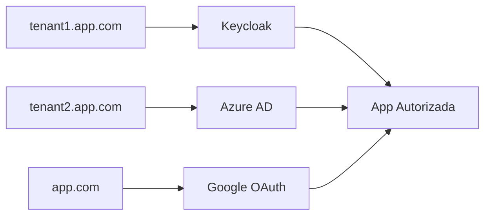

# Single sign on {#single-sign-on}
En las aplicaciones AWE puedes usar el método de autenticación SSO. Esta funcionalidad permite a un usuario utilizar una única cuenta para acceder a distintas aplicaciones (nombre de usuario y contraseña).

Para ejecutar el proveedor de identidad como única vía de inicio de sesión, consulta el [modo de seguridad IdP-first](idp-first.md).

## Azure EntraID {#azure-entraid}
AWE proporciona integración con el servicio de autenticación oauth2 de Azure utilizando el nativo `spring-cloud-azure-starter-active-directory`. El uso del Spring Boot Starter para Microsoft Entra ID te permite conectar tu aplicación web a un tenant de Microsoft Entra y proteger tu servidor de recursos con Microsoft Entra ID. Utiliza el protocolo Oauth 2.0 para proteger aplicaciones web y servidores de recursos.


Para habilitar el directorio activo oauth2 de Azure, tienes que añadir el starter spring-cloud-azure y configurar el tenantId de tu organización y el ID y el secreto de la aplicación.

```xml title="Add dependency"
    <dependency>
      <groupId>com.azure.spring</groupId>
      <artifactId>spring-cloud-azure-starter-active-directory</artifactId>
    </dependency>
```
```properties title="Configure azure EntraID properties"
# Enable related features.
spring.cloud.azure.active-directory.enabled=true
# Specifies your Active Directory ID:
spring.cloud.azure.active-directory.profile.tenant-id={CONFIGURE YOUR TENANT ID}
# Specifies your App Registration's Application ID:
spring.cloud.azure.active-directory.credential.client-id={CONFIGURE YOUR CLIENT ID}
# Specifies your App Registration's secret key:
spring.cloud.azure.active-directory.credential.client-secret={CONFIGURE YOUR SECRET KEY}
```

:::info Puedes visitar [este enlace](https://learn.microsoft.com/en-us/azure/developer/java/spring-framework/spring-boot-starter-for-azure-active-directory-developer-guide?tabs=SpringCloudAzure4x) para más información. 
:::

Por defecto, si el usuario que inicia sesión en la aplicación con este método no existe en la base de datos, se aprovisionará registrándolo mediante un nuevo registro en la tabla de usuarios.
Si no quieres este comportamiento, puedes desactivarlo poniendo a false la propiedad de configuración `awe.security.auto-provision-use`.

## Usuarios deshabilitados y bloqueados {#disabled-and-locked-users}

AWE mantiene la última palabra sobre quién puede entrar en la aplicación. Si el usuario que el proveedor de identidad acaba de
autenticar ya existe en AWE y está **deshabilitado** o **bloqueado**, el inicio de sesión SSO se rechaza: no se crea ninguna sesión de AWE,
la autenticación se descarta y el usuario ve una página de error que explica que el usuario está deshabilitado o
bloqueado en la aplicación. El proveedor no puede usarse para saltarse esos indicadores.

- Los usuarios que todavía no existen en AWE siguen las reglas de aprovisionamiento automático anteriores.
- La caducidad de la contraseña no se aplica a los inicios de sesión SSO, ya que no se usa la contraseña. Tampoco se comprueba la caducidad de la cuenta, porque AWE no tiene una columna de caducidad de cuenta.
- Cada rechazo se registra como una advertencia con el nombre de usuario.

## Mapeo de roles y sincronización de perfiles {#role-mapping-and-profile-synchronization}

En cada inicio de sesión SSO, AWE mapea las autoridades concedidas procedentes del proveedor de identidad a un perfil, usando
`awe.security.sso.filter-authority-prefix` para seleccionar y quitar el prefijo del claim de rol (ver arriba).

- Si el proveedor envía un rol que coincide con el prefijo, y difiere del perfil almacenado del usuario, el
  perfil se sincroniza (solo cuando el rol existe en la aplicación).
- Si el proveedor no envía ningún rol (ninguna autoridad, ninguna coincide con el prefijo, o una autoridad igual al propio
  prefijo), el comportamiento depende del usuario:
  - Los **usuarios nuevos, aprovisionados automáticamente**, se crean siempre con `awe.application.default-role`.
  - Los **usuarios existentes** conservan intacto su perfil actual de la base de datos, de modo que un perfil asignado manualmente en AWE
    no se restablece silenciosamente en el siguiente inicio de sesión.

```yaml title="Restore the default role on missing SSO roles"
awe:
  security:
    sso:
      overwrite-profile-with-default-role: true
```

:::caution Cambio de comportamiento desde la 4.12.9
Antes de la 4.12.9, un usuario existente sin un rol SSO coincidente se degradaba siempre a
`awe.application.default-role` en cada inicio de sesión, sobrescribiendo cualquier perfil asignado manualmente. Desde la 4.12.9 se
mantiene por defecto el perfil existente. Establece `awe.security.sso.overwrite-profile-with-default-role=true` para restaurar
el comportamiento anterior.
:::

## Keycloak {#keycloak}


Configura el cliente estableciendo la Root URL, los Web origins y la Admin URL con el nombre de host (https://\{hostname}).

También puedes establecer la Home URL con la ruta /applications y las Valid Post logout redirect URIs con "https://\{hostname}/applications".

Las Valid Redirect URIs deben establecerse a https://\{hostname}/auth/callback (también puedes establecer la menos segura https://\{hostname}/* con fines de pruebas/desarrollo, pero no se recomienda en producción).


Asegúrate de hacer clic en Save.

Debería haber una pestaña llamada Credentials. Puedes copiar el Client Secret que usaremos en la configuración de nuestra aplicación.


Hay que añadir las siguientes propiedades de configuración para integrar una aplicación AWE con el servidor Keycloak

```properties title="Configure keycloak oauth client properties"
################################################
# SSO login
################################################
# Enable AWE SSO
awe.security.sso.enabled=true
# Auto launch sso flow (skip native window sign in)
awe.security.sso.auto-launch=true
# Filter authority prefix (used to filtering granted authorities in post authentication process)
awe.security.sso.filter-authority-prefix=role_
# Enable generic SSO button in login screen
awe.security.sso.enable-generic-sso-button=true

# Provider issuer uri
spring.security.oauth2.client.provider.keycloak.issuer-uri=[PROVIDER_URI]
# Oauth provider name
spring.security.oauth2.client.registration.keycloak.provider=keycloak
# Authorization grant type for login
spring.security.oauth2.client.registration.keycloak.authorization-grant-type=authorization_code
# Client Id
spring.security.oauth2.client.registration.keycloak.client-id=[CLIENT_ID]
# Client Secret
spring.security.oauth2.client.registration.keycloak.client-secret=[CLIENT_SECRET]
# Scope request
spring.security.oauth2.client.registration.keycloak.scope=openid
# Redirect URI
spring.security.oauth2.client.registration.keycloak.redirect-uri={baseUrl}/login/oauth2/code/keycloak
```

## SSO multiinquilino {#multi-tenant-sso}


AWE Framework admite la autenticación SSO multiinquilino, lo que permite a distintas organizaciones o clientes usar la misma instancia de la aplicación con sus propias configuraciones OAuth2 independientes. Cada inquilino puede tener su propia configuración de proveedor de identidad mientras comparte el mismo código base de la aplicación.

### Cómo funciona el multiinquilino {#how-multi-tenant-works}

La funcionalidad multiinquilino de AWE usa **resolución de inquilino basada en subdominios**. Cuando un usuario accede a la aplicación a través de distintos subdominios, el sistema determina automáticamente qué configuración de inquilino usar:

- `tenant1.yourdomain.com` → Usa la configuración de "tenant1"
- `tenant2.yourdomain.com` → Usa la configuración de "tenant2"  
- `yourdomain.com` → Usa la configuración del inquilino por defecto


### Configuración {#configuration}

Para habilitar el SSO multiinquilino, necesitas configurar las siguientes propiedades:

```properties title="Enable Multi-Tenant SSO"
# Enable multi-tenant functionality
awe.security.sso.multitenant.enabled=true

# Set the default tenant (used when no specific tenant is detected)
awe.security.sso.multitenant.default-tenant=public
```

### Configuración específica de cada inquilino {#tenant-specific-configuration}

Cada inquilino requiere su propio registro OAuth2 y configuración de proveedor usando las propiedades estándar OAuth2 de Spring Security. La configuración sigue este patrón:

```properties title="Multi-Tenant Configuration Pattern"
# Provider configuration for a tenant
spring.security.oauth2.client.provider.{tenant-name}.issuer-uri={PROVIDER_ISSUER_URI}
spring.security.oauth2.client.provider.{tenant-name}.user-name-attribute=preferred_username

# Registration configuration for a tenant
spring.security.oauth2.client.registration.{tenant-name}.provider={tenant-name}
spring.security.oauth2.client.registration.{tenant-name}.client-id={CLIENT_ID}
spring.security.oauth2.client.registration.{tenant-name}.client-secret={CLIENT_SECRET}
spring.security.oauth2.client.registration.{tenant-name}.authorization-grant-type=authorization_code
spring.security.oauth2.client.registration.{tenant-name}.scope=openid,profile,email
spring.security.oauth2.client.registration.{tenant-name}.redirect-uri={baseUrl}/login/oauth2/code/{tenant-name}
spring.security.oauth2.client.registration.{tenant-name}.client-name={CLIENT_DISPLAY_NAME}
```

### Ejemplo de configuración completa {#complete-example-configuration}

Este es un ejemplo completo que muestra cómo configurar varios inquilinos:

```properties title="Complete Multi-Tenant Example"
################################################
# Multi-Tenant SSO Configuration
################################################
# Enable SSO authentication
awe.security.sso.enabled=true
# Auto launch sso flow (skip native window sign in)
awe.security.sso.auto-launch=true
# Filter authority prefix (used to filtering granted authorities in post authentication process)
awe.security.sso.filter-authority-prefix=role_


# Enable multi-tenant functionality
awe.security.sso.multitenant.enabled=true
awe.security.sso.multitenant.default-tenant=public

# Default tenant configuration (public.yourdomain.com or yourdomain.com)
# Provider
spring.security.oauth2.client.provider.public.issuer-uri=http://localhost:8081/realms/public

# Registration
spring.security.oauth2.client.registration.public.provider=public
spring.security.oauth2.client.registration.public.client-id={awe-public-client}
spring.security.oauth2.client.registration.public.client-secret={your-public-client-secret}
spring.security.oauth2.client.registration.public.authorization-grant-type=authorization_code
spring.security.oauth2.client.registration.public.scope=openid,profile,email
spring.security.oauth2.client.registration.public.redirect-uri={baseUrl}/login/oauth2/code/public
spring.security.oauth2.client.registration.public.client-name=AWE Public

# Company A tenant configuration (companyA.yourdomain.com)
# Provider
spring.security.oauth2.client.provider.companyA.issuer-uri=http://localhost:8081/realms/companyA

# Registration
spring.security.oauth2.client.registration.companyA.provider=companyA
spring.security.oauth2.client.registration.companyA.client-id={awe-companyA-client}
spring.security.oauth2.client.registration.companyA.client-secret={your-companyA-client-secret}
spring.security.oauth2.client.registration.companyA.authorization-grant-type=authorization_code
spring.security.oauth2.client.registration.companyA.scope=openid,profile,email
spring.security.oauth2.client.registration.companyA.redirect-uri={baseUrl}/login/oauth2/code/companyA
spring.security.oauth2.client.registration.companyA.client-name=AWE Company A

# Company B tenant configuration (companyB.yourdomain.com)
# Provider
spring.security.oauth2.client.provider.companyB.issuer-uri=http://localhost:8081/realms/companyB
spring.security.oauth2.client.provider.companyB.user-name-attribute=preferred_username

# Registration
spring.security.oauth2.client.registration.companyB.provider=companyB
spring.security.oauth2.client.registration.companyB.client-id={awe-companyB-client}
spring.security.oauth2.client.registration.companyB.client-secret={your-companyB-client-secret}
spring.security.oauth2.client.registration.companyB.authorization-grant-type=authorization_code
spring.security.oauth2.client.registration.companyB.scope=openid,profile,email
spring.security.oauth2.client.registration.companyB.redirect-uri={baseUrl}/login/oauth2/code/companyB
spring.security.oauth2.client.registration.companyB.client-name=AWE Company B
```

### Multiinquilino con distintos proveedores de identidad {#multi-tenant-with-different-identity-providers}

También puedes configurar distintos inquilinos para que usen proveedores de identidad completamente diferentes:

```properties title="Mixed Identity Providers Example"
# Tenant using Keycloak
spring.security.oauth2.client.provider.keycloak-tenant.issuer-uri=http://keycloak.example.com/realms/tenant1
spring.security.oauth2.client.registration.keycloak-tenant.provider=keycloak-tenant
spring.security.oauth2.client.registration.keycloak-tenant.client-id=keycloak-client
spring.security.oauth2.client.registration.keycloak-tenant.client-secret=keycloak-secret
spring.security.oauth2.client.registration.keycloak-tenant.authorization-grant-type=authorization_code
spring.security.oauth2.client.registration.keycloak-tenant.scope=openid,profile,email
spring.security.oauth2.client.registration.keycloak-tenant.redirect-uri={baseUrl}/login/oauth2/code/keycloak-tenant

# Tenant using Azure EntraID
spring.security.oauth2.client.provider.azure-tenant.issuer-uri=https://login.microsoftonline.com/{tenant-id}/v2.0
spring.security.oauth2.client.registration.azure-tenant.provider=azure-tenant
spring.security.oauth2.client.registration.azure-tenant.client-id=azure-client-id
spring.security.oauth2.client.registration.azure-tenant.client-secret=azure-client-secret
spring.security.oauth2.client.registration.azure-tenant.authorization-grant-type=authorization_code
spring.security.oauth2.client.registration.azure-tenant.scope=openid,profile,email
spring.security.oauth2.client.registration.azure-tenant.redirect-uri={baseUrl}/login/oauth2/code/azure-tenant

# Tenant using Google
spring.security.oauth2.client.provider.google-tenant.issuer-uri=https://accounts.google.com
spring.security.oauth2.client.registration.google-tenant.provider=google-tenant
spring.security.oauth2.client.registration.google-tenant.client-id=google-client-id
spring.security.oauth2.client.registration.google-tenant.client-secret=google-client-secret
spring.security.oauth2.client.registration.google-tenant.authorization-grant-type=authorization_code
spring.security.oauth2.client.registration.google-tenant.scope=openid,profile,email
spring.security.oauth2.client.registration.google-tenant.redirect-uri={baseUrl}/login/oauth2/code/google-tenant
```

### Configuración de DNS {#dns-configuration}

Para que funcione la resolución de inquilino basada en subdominios, necesitas configurar tu DNS para que todos los subdominios apunten a tu aplicación:

```bash title="DNS Configuration Example"
# Main domain
yourdomain.com        A    192.168.1.100

# Wildcard subdomain (points all subdomains to the same server)
*.yourdomain.com      A    192.168.1.100
```

### Ventajas del SSO multiinquilino {#benefits-of-multi-tenant-sso}

- **Aislamiento**: Cada inquilino tiene su propia configuración de autenticación
- **Flexibilidad**: Distintos inquilinos pueden usar distintos proveedores de identidad
- **Escalabilidad**: Una única instancia de la aplicación atiende a varias organizaciones
- **Mantenimiento**: Las actualizaciones centralizadas de la aplicación benefician a todos los inquilinos
- **Seguridad**: Las configuraciones de los inquilinos están completamente separadas

::::info
La funcionalidad multiinquilino gestiona automáticamente la resolución del inquilino según el subdominio de la petición. Si un inquilino no está configurado, el sistema recurre a la configuración del inquilino por defecto.
::::

::::warning
Asegúrate de configurar correctamente tu DNS y tus certificados SSL para admitir subdominios comodín cuando uses la funcionalidad multiinquilino.
::::

### Añadir proveedores de identidad {#add-identity-providers}
Puedes integrar otros proveedores de identidad para usarlos en tu proceso de autenticación. En esta guía usamos Azure EntraID como ejemplo.


En la página de detalle, rellena los datos como se indica a continuación:
* Introduce el alias que prefieras. Habilita use discovery endpoint, si no está ya habilitado
* Introduce la Discovery URL de Azure (copiada antes) en el Discovery endpoint


* Introduce el Client ID. Es el ID de aplicación (cliente) copiado del registro de aplicación de Azure.
* Introduce el Client Secret. Es el secreto de aplicación copiado del registro de aplicación de Azure


### Mappers {#mappers}

Al configurar roles/grupos, el proceso es algo más tedioso, ya que los claims usados para ello no son estándar. Cada proveedor usa un método distinto.

Para recoger la información que nos envía el proveedor, tendremos que crear algunos mappers que recuperen la información y la traduzcan al entorno de keycloak.

- Mappers de grupos

Por defecto, Azure EntraID no muestra los grupos asociados a cada usuario. Para recuperar los grupos a los que pertenece un usuario, es necesario configurar Azure para que envíe un claim personalizado `groups` con el tipo de token ClientID.


Después, tienes que crear un nuevo mapper para el proveedor de identidad que mapee el objectId del grupo del usuario a un rol de keycloak.


- Mappers de roles de aplicación

Para recuperar los roles de aplicación de una aplicación registrada en Azure EntraID, es necesario crear un `advanced claim custom role mapper` que mapee la clave *role* del claim con el nombre del rol de aplicación en Azure y con el rol de keycloak.


