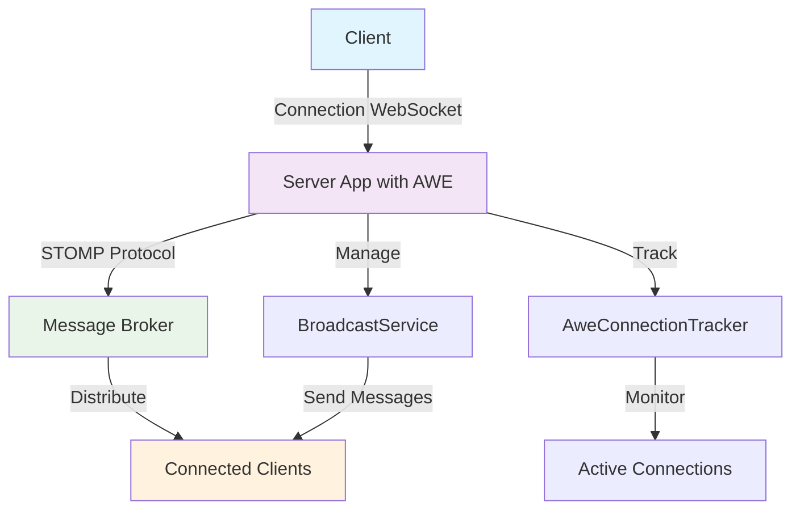
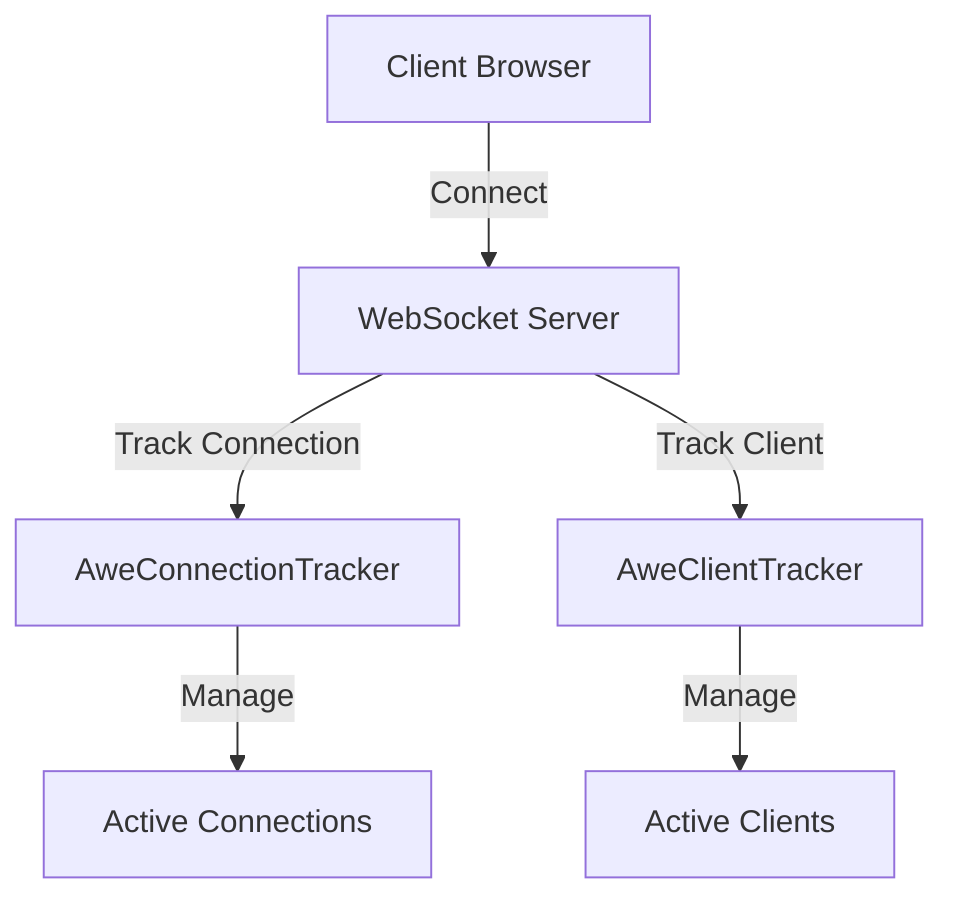

# 🔌 WebSockets en AWE {#-websockets-in-awe}

## 🚀 Introducción {#-introduction}

Los WebSockets proporcionan una conexión persistente entre un cliente y un servidor, lo que permite una comunicación bidireccional en tiempo real. El framework AWE integra los WebSockets utilizando el protocolo STOMP (Simple Text Oriented Messaging Protocol) sobre WebSocket, que ofrece una forma estandarizada de enviar y recibir mensajes.



## 🔧 Cómo funcionan los WebSockets en AWE {#-how-websockets-work-in-awe}

El framework AWE utiliza el soporte de WebSocket de Spring para implementar la funcionalidad de WebSocket. La implementación consta de varios elementos clave:

### ⚙️ Configuración de WebSocket {#️-websocket-configuration}

La configuración de WebSocket en AWE la gestiona la clase `WebsocketConfig`, que extiende `AbstractSessionWebSocketMessageBrokerConfigurer` de Spring. Esta clase configura el broker de mensajes y registra los endpoints STOMP.

> 💡 **Punto clave**: La configuración se establece automáticamente cuando incluye el AWE Spring Boot Starter en su proyecto.

La configuración admite dos tipos de brokers de mensajes:

| Tipo de broker         | Descripción                                                                                            | Caso de uso                  |
|------------------------|--------------------------------------------------------------------------------------------------------|------------------------------|
| **Broker simple**      | Se usa por defecto; es un broker de mensajes en memoria que gestiona el enrutamiento de mensajes dentro de la aplicación. | Aplicaciones de una sola instancia |
| **Relay de broker STOMP** | Cuando está habilitado, retransmite los mensajes a un broker de mensajes STOMP externo como RabbitMQ. | Entornos en clúster          |

### 🔍 Seguimiento de conexiones {#-connection-tracking}

AWE proporciona seguimiento de conexiones mediante las clases `AweConnectionTracker` y `AweClientTracker`. Estas realizan el seguimiento de las conexiones WebSocket y de los clientes activos, lo que permite a la aplicación gestionar y comunicarse con los clientes conectados.



### 📢 Servicio de difusión {#-broadcasting-service}

El `BroadcastService` permite enviar mensajes a todos los clientes conectados o a clientes concretos según su ID de sesión o su ID de usuario. Es útil para notificaciones, actualizaciones en tiempo real y otros escenarios de difusión.

### 📡 Eventos de WebSocket {#-websocket-events}

El `WebSocketEventListener` gestiona los eventos de conexión de WebSocket, como cuando un cliente se conecta o se desconecta. Esto permite a la aplicación realizar acciones cuando se producen estos eventos.

## ⚙️ Configuración de WebSockets en AWE {#️-configuring-websockets-in-awe}

Los WebSockets en AWE pueden configurarse mediante propiedades en su archivo `application.properties` o `application.yml`. Las propiedades tienen el prefijo `awe.websocket.stomp`.

### 🔰 Configuración básica {#-basic-configuration}

Por defecto, AWE utiliza un broker de mensajes simple en memoria. Es adecuado para la mayoría de las aplicaciones en las que los mensajes no necesitan persistirse ni compartirse entre varias instancias.

```properties
# Default configuration (Simple Broker)
awe.websocket.stomp.enable-stomp-broker-relay=false
```

### 🔄 Uso de un broker STOMP externo {#-using-an-external-stomp-broker}

Para escenarios más avanzados, como el clustering o la persistencia de mensajes, puede configurar AWE para que use un broker STOMP externo como RabbitMQ:

```properties
# Enable STOMP broker relay
awe.websocket.stomp.enable-stomp-broker-relay=true
awe.websocket.stomp.relay-host=rabbitmq-service
awe.websocket.stomp.relay-port=61613
awe.websocket.stomp.client-login=guest
awe.websocket.stomp.client-passcode=guest
awe.websocket.stomp.system-login=guest
awe.websocket.stomp.system-passcode=guest
```

### 🏘️ Compartir un broker entre aplicaciones {#️-sharing-a-broker-between-applications}

Cuando varias aplicaciones comparten el mismo broker STOMP, establezca un virtual host para separarlas, de modo que
los destinos de una aplicación no sean visibles para las demás:

```properties
awe.websocket.stomp.enable-stomp-broker-relay=true
awe.websocket.stomp.relay-host=rabbitmq-service
awe.websocket.stomp.virtual-host=my-application
```

El virtual host debe existir ya en el broker, y las credenciales configuradas deben tener concedido
acceso a él. Cuando esta propiedad no se establece, el broker sigue aplicando su propio valor por defecto, que tanto en
`RabbitMQ` como en `ActiveMQ` es el host de relay.

### 🎯 Prefijos de destino {#-destination-prefixes}

Puede configurar los prefijos de destino que gestiona el broker de mensajes:

```properties
# Configure destination prefixes
awe.websocket.stomp.destination-prefixes=/topic,/queue
```

## 💻 Uso de WebSockets en su aplicación {#-using-websockets-in-your-application}

### 📤 Envío de mensajes desde el servidor {#-sending-messages-from-the-server}

Para enviar mensajes desde el servidor a los clientes, puede usar el `BroadcastService`:

```java
// In your service or controller class
public class YourService {
    @Autowired
    private BroadcastService broadcastService;

    public void sendNotification() {
        // Send Screen client action to all clients
        broadcastService.broadcastMessage(new ScreenActionBuilder("newScreen").build());

        // Send a message to a specific client
        broadcastService.sendMessageToUser("userId", "Hello, specific user!");
    }
}
```

## ☁️ Configuración en entornos cloud {#️-cloud-environment-configuration}

En un entorno cloud, debe configurar un relay de broker STOMP externo como `RabbitMQ` o `ActiveMQ` y configurar las propiedades de configuración de AWE para el relay de websocket. Esto es útil al desplegar varias instancias de su aplicación, ya que permite compartir los mensajes entre todas las instancias.

```properties
# Enable STOMP broker relay
awe.websocket.stomp.enable-stomp-broker-relay=true
```

> ⚠️ **Importante**: Al desplegar en un entorno en clúster, asegúrese de que todas las instancias puedan acceder al mismo broker de mensajes para garantizar la entrega de mensajes a todos los clientes, independientemente de la instancia a la que estén conectados.

## 🏁 Conclusión {#-conclusion}

Los WebSockets en AWE proporcionan una forma potente de implementar la comunicación en tiempo real entre el servidor y los clientes. Al usar STOMP sobre WebSocket, AWE ofrece un sistema de mensajería estandarizado y fiable que puede configurarse y ampliarse fácilmente para satisfacer las necesidades de su aplicación.

Para más información sobre las propiedades de configuración disponibles, consulte la documentación de [Propiedades](properties.md#awe-websocket-properties).
